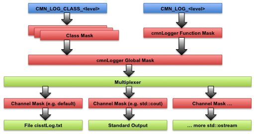

What does ``CMN_DECLARE_SERVICES`` do? And ``CMN_IMPLEMENT_SERVICES``?
======================================================================

All objects derived from ``cmnGenericObject`` can (and probably should) use these macros. The base class ``cmnGenericObject`` defines a few virtual methods, some of them being *pure* virtual. Without any declaration and definition of these virtual methods in the derived classes it would not be possible to instantiate any object. As these methods are always declared and defined the same way, one can use macros to perform these tasks. When and where to use the macros:

-  ``CMN_DECLARE_SERVICES`` should be used in the class declaration, e.g.

   .. code:: c++

        // in file aDerivedClass.h
        class aDerivedClass: public cmnGenericObject
        {
            CMN_DECLARE_SERVICES(CMN_NO_DYNAMIC_CREATION, CMN_LOG_ALLOW_DEFAULT);
          protected:
             ...
        };

-  The first parameter can be ``CMN_NO_DYNAMIC_CREATION``, ``CMN_DYNAMIC_CREATION``, ``CMN_DYNAMIC_CREATION_SETNAME``, or ``CMN_DYNAMIC_CREATION_ONEARG``. Any of these options, except ``CMN_NO_DYNAMIC_CREATION``, enable dynamic creation of an object using the class name provided as a string (object factory pattern). Dynamic creation is required for de-serialization or dynamic loading. The difference between the dynamic creation options is:

   -  ``CMN_DYNAMIC_CREATION``: class must define an accessible (public) default constructor and copy constructor.
   -  ``CMN_DYNAMIC_CREATION_SETNAME``: class must define a public default constructor and ``SetName`` method (this is for backward compatibility and is not recommended)
   -  ``CMN_DYNAMIC_CREATION_ONEARG``: class must define a public constructor that takes one parameter, passed as a ``const`` reference.

-  The second parameter is the default Log filter (aka LoD). This is used to control the amount of human readable log/messages all instantiations of the class will generate. See the cmnLogger section below.
-  ``CMN_DECLARE_SERVICE_INSTANTIATION`` should be used in the header file containing the class declaration. Ideally, it should be placed right after the class declaration:

   .. code:: c++

         class aDerivedClass: public cmnGenericObject
         {
             CMN_DECLARE_SERVICES(CMN_DYNAMIC_CREATION, CMN_LOG_ALLOW_DEFAULT);
           protected:
             ...
         };
         CMN_DECLARE_SERVICES_INSTANTIATION(aDerivedClass);

For the curious programmers, this macro is required to declare a specialization of a global function used to access the class services (dynamic creation and LoD settings).

-  ``CMN_IMPLEMENT_SERVICES`` (or ``CMN_IMPLEMENT_SERVICES_DERIVED`` or ``CMN_IMPLEMENT_SERVICES_DERIVED_ONEARG``) should be placed in your definition file, e.g. :

   .. code:: c++

         // in file aDerivedClass.cpp
         CMN_IMPLEMENT_SERVICES(aDerivedClass);

-  ``CMN_IMPLEMENT_SERVICES_DERIVED`` and ``CMN_IMPLEMENT_SERVICES_DERIVED_ONEARG`` both take the base class as the second parameter. This is typically used when knowledge of the class hierarchy is important (e.g., for components in cisstMultiTask).
-  ``CMN_IMPLEMENT_SERVICES_DERIVED_ONEARG`` (which is actually defined in cisstMultiTask) takes the constructor argument type as its third parameter.

To use these macros, you will need the following includes:

.. code:: c++

   #include <cisstCommon/cmnGenericObject.h>
   #include <cisstCommon/cmnClassServices.h>
   #include <cisstCommon/cmnClassRegisterMacros.h>

What is ``CISST_EXPORT``?
=========================

Export a symbol for a Dll.

This macro is used only for the creation of Windows Dll with Visual C++. On all other operating systems or compilers, this macro does nothing.

With Windows and Microsoft VC++, whenever someone needs to create a Dll, the macro expands as ``_declspec(dllexport)``. To specify that the file is used to create a Dll, the preprocessor must have ``<library>_EXPORTS`` defined. This value is set automatically for each library by CMake if a DLL is to be compiled.

Usage: Append macros to declare exported variables, functions and classes:

-  A global variable in a header file:

   .. code:: c++

         extern CISST_EXPORT myType myVariable;

-  A global function in a header file:

   .. code:: c++

         CISST_EXPORT myType functionName(..);

-  A class in a header file:

   .. code:: c++

         class CISST_EXPORT className { ... };

-  For a templated class or method with inlined code only, do not use ``CISST_EXPORT``
-  For a template class with no inlined code at all, use ``CISST_EXPORT`` for the class declaration
-  For a class mixing inlined and non inlined code, use ``CISST_EXPORT`` for the declarations of the non inlined code only

When one needs to use an existing Dll, the macro must expand as ``_declspec(dllimport)``. To do so, the preprocessor must have ``CISST_DLL`` defined. Again, using CMake, this is automatically set.

How does ``cmnLogger`` work?
============================

``cmnLogger`` is a singleton class that allows to control most aspects for human readable logging. These logs are used as a trace of execution and can help figure out what went wrong. One key feature of the cisst logging system is that one can filter messages and redirect them to one or more output streams (by default, look for the file ``cisstLog.txt``). The log filters/masks are implemented in such way that if the user is not interested in some detailed logs, the computational cost is minimal (bitwise compare). The logs filters are not set using pre-processor directives (such as ``#ifndef DEBUG``) and can be controlled at runtime (using a GUI for example). Each message is associated to a level of detail and can be filtered/masked at the following levels (in the following order):

-  Class mask, this value is set for all instances (objects) of a given class (see class registration macros ``CMN_DECLARE_SERVICES``)
-  Global mask, i.e. ``cmnLogger`` mask
-  Output stream mask. Since a message can be send to different streams using a built-in multiplexer, each stream can have its own mask (e.g. log file can keep all logs while standard output or GUI can display errors only)

It is important to note that if a message is filtered out by either the class or ``cmnLogger`` mask, the runtime cost is minimal.

Level of details associated to messages
---------------------------------------

Each message is associated to a level using the macros ``CMN_LOG_CLASS_<levelOfDetail>`` and ``CMN_LOG_<levelOfDetail>``. The different levels of details are:

-  ``INIT_ERROR``
-  ``INIT_WARNING``
-  ``INIT_VERBOSE``
-  ``INIT_DEBUG``
-  ``RUN_ERROR``
-  ``RUN_WARNING``
-  ``RUN_VERBOSE``
-  ``RUN_DEBUG``
-  ``VERY_VERBOSE`` For example, in a class registered, one could use:

.. code:: c++

   CMN_LOG_CLASS_INIT_ERROR << "can't find configuration file: " << filename << std::endl;

Anywhere else (i.e. in a function, class not registered, ...), one must use the non-class macros:

.. code:: c++

   CMN_LOG_RUN_ERROR << "invalid value: " << myVariable << std::endl;

Log masks
---------

Once a log message is "created", it can be filtered at multiple levels, as show in the following pictures:

A programmer can configure the logs by:

-  Changing the overall log filter/mask using ``cmnLogger::SetMask(CMN_LOG_ALLOW_ALL)``. In this case, all messages can go through ``cmnLogger``. A radical and efficient way to stop all logs is to use ``cmnLogger::SetMask(CMN_LOG_ALLOW_NONE)``.
-  Setting the mask for global functions (and un-registered classes), this will affect all logs generated with the macros ``CMN_LOG_<level>``:
-  ``cmnLogger::SetMaskFunction(CMN_LOG_ALLOW_ERRORS)``
-  Setting the mask for one or more classes, this will affect all logs generated with the macros ``CMN_LOG_CLASS_<level>``:
-  ``cmnLogger::SetMaskClass("className", CMN_LOG_ALLOW_ERRORS)`` for a single class.
-  ``cmnLogger::SetMaskClassMatching("cmn", CMN_LOG_ALLOW_ALL)`` for any class with the string "cmn" in its name.
-  ``cmnLogger::SetMaskClassAll(CMN_LOG_ALL_NONE)`` for all classes. This can be useful to silence all classes and then turn a few back on.
-  Adding new log channels, i.e. the log messages can be duplicated (multi-cast) to different output streams (any stream derived from ``std::ostream``) using ``cmnLogger::AddChannel(std::cout, CMN_LOG_ALLOW_ERRORS_AND_WARNINGS)``. In this case, the user will see all errors and warnings on the standard output (provided the previous filters, class and ``cmnLogger``, let this message pass).
-  Changing the mask for the default log file (``cisstLog.txt``) using ``cmnLogger::SetMaskDefaultLog(CMN_LOG_ALLOW_ALL)``.

Example
-------

.. code:: c++

   cmnLogger::SetMask(CMN_LOG_ALLOW_ALL);
   // get all messages to log file
   cmnLogger::SetMaskDefaultLog(CMN_LOG_ALLOW_ALL);
   // add cout for errors and warnings only
   cmnLogger::AddChannel(std::cout, CMN_LOG_ALLOW_ERRORS_AND_WARNINGS);
   // only get errors for global functions and un-registered classes
   cmnLogger::SetMaskFunction(CMN_LOG_ALLOW_ERRORS);
   // only get errors for most classes
   cmnLogger::SetMaskClassAll(CMN_LOG_ALLOW_ERRORS);
   // specify a higher, very verbose log level for these classes
   cmnLogger::SetMaskClass("sineTask", CMN_LOG_ALLOW_ALL);
   cmnLogger::SetMaskClass("displayTask", CMN_LOG_ALLOW_ALL);

What is the cmnClassRegister?
=============================

Main register for classes.

This class handles the registration of classes. The registration process allows to retrieve by name some information about a specific class from a centralized point. The current version of the class register allows to:

-  Create dynamically an object based on a name provided as a string. This feature is required for the deserialization process (from a buffer and a name, create a new object of a given type defined by a string).

-  Modify the logging level of detail for a given class. See cmnLogger for more details regarding the logging in cisst.

One can only register classes derived from cmnGenericObject. The registration requires the use of ``CMN_DECLARE_SERVICES`` (or ``CMN_DECLARE_SERVICES_EXPORT``), ``CMN_DECLARE_SERVICES_INSTANTIATION`` (or ``CMN_DECLARE_SERVICES_INSTANTIATION_EXPORT``) and ``CMN_IMPLEMENT_SERVICES`` (or ``CMN_IMPLEMENT_SERVICES_TEMPLATED``).

What is the cmnObjectRegister?
------------------------------

The Object register allows to register some objects by name. Since the object register is implemented as a singleton, it allows to retrieve an object from anywhere.

This mechanism can be used to share an object between different threads. Another example is the embedding of a scripting language such as Python. In this case, the programmer can use the Register() method to register an object with a given name. Within the Python shell, it is then possible to retrieve by name a "pointer" on the same object.

The main restriction is that all the registered objects must be derived from cmnGenericObject.

cmnLogLoD related compilation error (can not convert ``int`` to ``cmnLogLoD``)
==============================================================================

In release 429, the log systems has been updated to use a an enum to define the level of details for human readable log, if you need to retrieve a previous version of cisst, use tag /branches/tags/pre-log-lod-enum. This means that the macros ``CMN_LOG`` and ``CMN_LOG_CLASS`` now require a parameter of type cmnLogLoD. To simplify the code, we provide the following macros:

-  ``CMN_LOG_INIT_ERROR`` to replace ``CMN_LOG(1)``
-  ``CMN_LOG_INIT_WARNING`` to replace ``CMN_LOG(2)``
-  ``CMN_LOG_INIT_VERBOSE`` to replace ``CMN_LOG(3)``
-  ``CMN_LOG_INIT_DEBUG`` to replace ``CMN_LOG(4)``
-  ``CMN_LOG_RUN_ERROR`` to replace ``CMN_LOG(5)``
-  ``CMN_LOG_RUN_WARNING`` to replace ``CMN_LOG(6)``
-  ``CMN_LOG_RUN_VERBOSE`` to replace ``CMN_LOG(7)``
-  ``CMN_LOG_RUN_DEBUG`` to replace ``CMN_LOG(8)``
-  ``CMN_LOG_VERY_VERBOSE`` to replace ``CMN_LOG(9)`` If you were using a level of detail greater than 9, please use ``CMN_LOG_VERY_VERBOSE``. Equivalent macros are available to replace ``CMN_LOG_CLASS``, e.g. ``CMN_LOG_CLASS(1)`` should be replaced by ``CMN_LOG_CLASS_INIT_ERROR``.

All macros and methods used to change the levels of details to filter the messages also need to be updated to use the possible levels of details as defined in ``cmnLogLoD.h``:

-  The type ``cmnLogger:LoDType`` is being replaced by ``cmnLogLoD``
-  ``CMN_DECLARE_SERVICES`` and ``CMN_DECLARE_SERVICES_EXPORT``, e.g. ``CMN_DECLARE_SERVICES(CMN_DYNAMIC_CREATION, CMN_LOG_LOD_RUN_ERROR)``
-  ``cmnLogger::AddChannel(outputStream, CMN_LOG_LOD_RUN_ERROR)`` replaces ``cmnLogger::GetMultiplexer()->AddChannel(outputStream, 5)``
-  ``cmnClassRegister::SetLoD("TestA", CMN_LOG_LOD_RUN_WARNING)`` replaces ``cmnClassRegister::SetLoD("TestA", 6)``
-  ``cmnLogger::SetLoD(CMN_LOG_LOD_RUN_ERROR)`` replaces ``cmnLogger::SetLoD(5)``
-  ``cmnLogger::ResumeDefaultLog(CMN_LOG_LOD_VERY_VERBOSE)`` replaces ``cmnLogger::ResumeDefaultLog(9)``

What is cmnPrintf() and how can it be used?
===========================================

``cmnPrintf()`` performs a feature similar to ``sprintf()`` of the standard C library, with the difference being that it builds a formatted string in a stream rather than in a predefined character array. Using ``cmnPrintf()`` has the advantage that a character array of a specified length does not have to be predefined. Thus, the programmer does not have to worry about writing too many characters and overstepping the end of a predefined character array.

``cmnPrintf()`` is especially useful when a high level of control is desired for the formatted output (i.e. setting precision, width, etc.). Adjusting these settings for a standard stream is cumbersome and painful due to the many function calls required whenever the options are changed. Adjusting these settings in a formatted string is much easier and pleasant, since these options are specified in the string itself rather than via function calls.

``cmnPrintf()`` may be used with the standard streams (cin, cout, etc.). Using these streams does not allow the formatted string to be referenced within the program once it is built, however. In order to build a formatted string that can be used within a program, use ``std::stringstream`` instead, as shown in the example below.

.. code:: c++

   #include <cisstCommon/cmnPrintf.h>

   double myVar = 7.4728;
   std::stringstream stringStream;

   // write formatted output to the string stream
   stringStream << cmnPrintf("myVar: %f\n") << myVar;
   stringStream << cmnPrintf("myVar: %.3f\n") << myVar;
   stringStream << cmnPrintf("myVar: %8f\n") << myVar;
   stringStream << cmnPrintf("myVar: %08.2f\n") << myVar;
      
   // retrieve the formatted string from string stream and display
   // on standard output
   std::cout << stringStream.str() << std::endl;

The output from this example is:

::

   myVar: 7.472800
   myVar: 7.473
   myVar: 7.472800
   myVar: 00007.47
