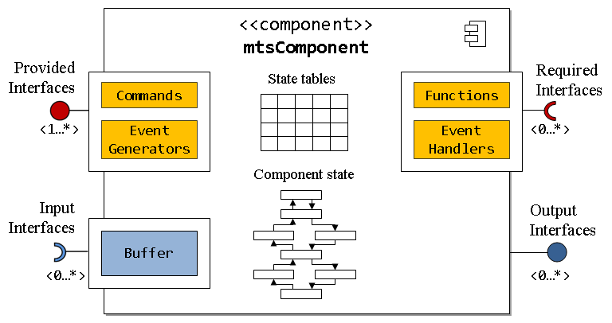
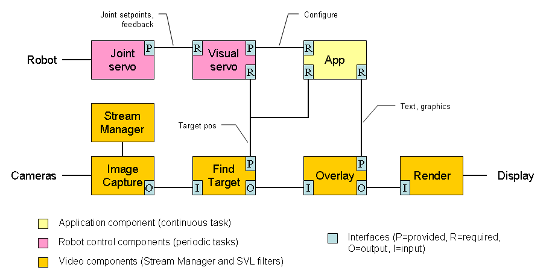
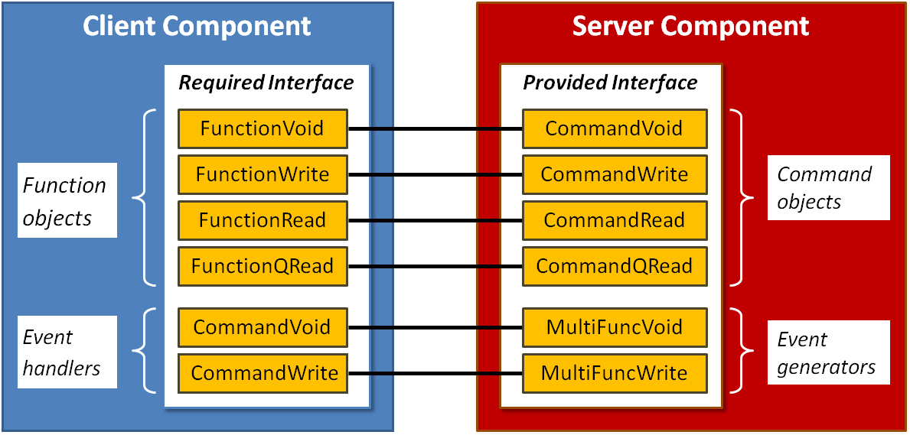

.. _1-introduction:

Concepts
========

This is an introduction to the features of cisstMultiTask, which provides the component-based framework for the cisst package. It replaces the outdated `cisstMultiTask Quick Start <http://unittest.lcsr.jhu.edu/cisst/downloads/cisst/current/doc/latex/multiTask-quickstart.pdf>`__. The code and examples are available as part of the cisst repository http://github.com/jhu-cisst/cisst. The library headers are in ``cisst/cisstMultiTask`` and the code can be found in ``cisst/cisstMultiTask/code``. Examples can be found on ``cisst/cisstMultiTask/examples`` and unit tests are in ``cisst/cisstMultiTask/tests``. To compile your own code, remember to include ``cisstMultiTask.h`` (which includes all public header files) or the required set of individual files (e.g., ``cisstMultiTask/mtsXXXX.h``). Per convention, all the symbols starting with ``mts`` are defined in cisstMultiTask. Symbols prefixed with ``cmn``, ``osa`` and ``vct`` come from cisstCommon, cisstOSAbstraction and cisstVector, respectively.

.. _11-component-model:

1.1 Component Model
-------------------

A cisstMultiTask component can include "provided interfaces", "required interfaces", "input interfaces", and "output interfaces". The base component class ``mtsComponent`` provides all the base implementation to add interfaces but doesn't manage any thread nor thread safety mechanism. If a thread is needed for a given component, this component should be derived from one of the ``mtsTask`` derived classes (``mtsTaskContinuous``, ``mtsTaskPeriodic``, ``mtsTaskFromSignal``, ``mtsTaskFromCallback``, ...). Libraries based on cisstMultiTask can also define their own base component type (e.g. cisstStereoVision filters are components derived from ``svlFilterBase``). Internally, a component may contain "state tables" to manage important component data. The component may have a state associated with it (e.g., initialized, paused, started). Note that every component contains at least two provided interface: (1) an internal interface that is connected to the "component manager", and (2) an ``ExecOut`` interface that can be used to provide the execution thread to other components.

.. _12-components-in-use:

1.2 Components In Use
---------------------

The above figure shows a hypothetical deployment of components for visual servo control of a robot. A video stream (bottom) captures stereo images; it includes a Find Target filter that locates the target for visual servoing. The coordinates of this target are made available to the Visual Servo control component (a periodic task) via a provided interface. The Visual Servo component also relies on (has a Required interface for) a lower-level Joint Servo controller. The App component provides the overall application control (e.g., turning visual servo on/off) and can overlay information on the video output by invoking commands in the Provided interface of the Overlay filter.

An important point to consider is how to achieve "plug & play" capabilities within the system. For example, it is desirable for this application to work for any robot that can provide a low-level Joint Servo controller. This requires some standardization -- in the cisst library, we have chosen to standardize at the command level; specifically, by standardizing the name of a command (a string) and its payload (a data type). For example, the command to retrieve the joint positions should be named "GetPositionJoint" and it should return the joint positions in an instance of the ``prmPositionJointGet`` class (see cisstParameterTypes library). The cisst library does not enforce this standard, however, so users can create components with any command names and data types, but will lose the benefits of "plug & play".

.. _13-provided-and-required-interfaces:

1.3 Provided and Required Interfaces
------------------------------------

All components can have multiple ''provided interfaces'' (``mtsInterfaceProvided``) and ''required interfaces'' (``mtsInterfaceRequired``). A component that contains only provided interfaces can be called a ''Server'', whereas a component that contains only required interfaces can be called a ''Client''. Of course, the more typical case is that a component will have both provided and required interfaces.

Each provided interface can have multiple command objects which encapsulate the available services, as well as event generators that broadcast events with or without payloads. Several command object classes are defined to handle commands with no parameters, one input parameter, one output parameter, or one of each, as described `below <#4--commands-and-functions>`__. Provided interfaces are created and added to a component using ``AddInterfaceProvided("name")``. Once created, they can be populated with commands and events.

Each required interface has multiple function objects that are bound to command objects to use the services that the connected command objects provide. It may also have event receivers or handlers to respond to events generated by the connected component. As with the command objects, several corresponding function object classes are defined. When two interfaces are connected to each other, all function objects in the required interface are bound to the corresponding command objects in the provided interface, and event handlers/receivers in the required interface become observers of the events generated by the provided interface. Required interfaces are created and added to a component using ``AddInterfaceRequired("name")``. Once created, they can be populated with functions and event handlers/receivers.

It is important to note that during the connection between a required and a provided interface the following rules apply:

-  Required interfaces don't have to use all the commands of the provided interfaces
-  Required interfaces don't have to provide event handlers or receivers for all the events of the provided interface
-  All event handlers added to a required interface must match an event of the provided interface
-  Functions added to the required interface can be marked as "optional" to permit a connection even if the provided interface doesn't provide a matching command. All functions marked as "required" must match a provided command.

Interfaces automatically create message queues when needed to ensure thread safety (for task components) for both commands and events. This behavior can be overloaded at the interface or command/event level if the user has a more efficient way to enforce thread safety.

.. _14-output-and-input-interfaces:

1.4 Output and Input Interfaces
-------------------------------

All components can have multiple ''output interfaces'' (``mtsInterfaceOutput``). An output interface provides an output data port (e.g., a video source). It is created and added to a component using ``AddInterfaceOutput("name")``.

All components can have multiple ''input interfaces'' (``mtsInterfaceOutput``). An input interface is used to accept data, such as a video image. It is created and added to component using ``AddInterfaceInput("name")``.

For further details, see the `cisstStereoVision Tutorial <cisstStereoVision-tutorial>`__.

.. _15-technical-concepts:

1.5 Technical concepts
----------------------

To provide a flexible programming interface (API), the cisstMultiTask library uses the “command pattern”. In this design, an object API is not defined by its public methods but rather by a list of pointers on methods. The list of methods pointers (commands) can be defined and queried at run-time which provides much more flexibility than compile-time binding. The matching between commands is performed using a string compare.

Commands are grouped in "provided interfaces" corresponding to the list of provided functionalities. A component can have multiple provided interfaces to group its functionalities. In other words, a '''component''' can have multiple '''provided interfaces''' and each '''provided interface''' can have multiple '''commands'''. To use the provided functionalities of a given component (similar to a "server"), one needs to create a "client" component with a list of required "functions" grouped in a "required interface" . In other words a '''component''' can have multiple '''required interfaces''' and each '''required interface''' can have multiple '''functions'''. For the "client" component to use the "server" features, its required interface needs to be connected to the "server"'s provided interface.

When the two interfaces get connected, the "client" required functions get bound to the "server" provided commands based on their names (strings). At runtime, a call to the required function causes an invocation of the provided command and ultimately runs the underlying method. Once the initial matching based on strings is performed, all calls within a single process rely on method pointers and are therefore quite efficient.

To allow some communication from the "server"'s provided interface to the "client"'s required interface, cisstMultiTask supports events. Each required interface can contain a list of events to observe and for each observed event must provide an event handler or an event receiver.

In this introduction, we used the terms "client" and "server". These terms can be used to illustrate a single connection between "componentA::InterfaceRequired" and "componentB::InterfaceProvided". Since cisstMultiTask allows any component to have both required and provided interfaces, the reader should know that a component can be either "client" or "server" depending on which interface is being used.

The main classes of the cisstMultiTask library are:

-  Component: ``mtsComponent``, ``mtsTask``, ``mtsTaskContinuous``, ``mtsTaskFromSignal``, ``mtsTaskFromCallback``, ``mtsTaskPeriodic``, ...
-  Interfaces: ``mtsInterfaceProvided`` and ``mtsInterfaceRequired``
-  Commands: ``mtsCommandVoid``, ``mtsCommandWrite``, ``mtsCommandRead``, ``mtsCommandQualifiedRead``
-  Events
-  State tables: ``mtsStateTable``
-  Component manager

.. _2-components-and-tasks:

2 Components and tasks
----------------------

As mentioned in the introduction, cisstMultiTask provides different base components that can be used as a base class depending on the user's application:

-  ``mtsComponent``: this is the base class of all components. It provides all the mechanisms to create interfaces but doesn't handle any threading. It doesn't own a thread nor use thread-safe mechanisms by default.
-  ``mtsTask``: this class is not intended to be used directly. It assumes a thread will be used for all derived components and adds mechanisms to ensure thread safety when using commands to communicate between components. It defines a pure virtual ``Run`` method.

   -  ``mtsTaskContinuous``: base class for a task running as fast as possible; i.e., the ``Run`` method will be called over and over, as fast as possible.
   -  ``mtsTaskPeriodic``: base class for a task running at a given periodicity (e.g., the ``Run`` method is called every 100 milliseconds). The jitter (variation between actual and desired period) depends on the operating system. Best performances are achieved using a real time operating system (Linux RTAI, Xenomai, QNX, ...).
   -  ``mtsTaskFromSignal``: base class for a task that should run only upon receipt of a command. This task is appropriate for event based applications -- the ``Run`` method gets called only when a command is queued.
   -  ``mtsTaskFromCallback``: base class for a task using an external trigger to start any computation. The ``Run`` method is used as a callback attached to an external library, driver, ...

-  ``svlFilterBase``: this class is defined in the `cisstStereoVision (SVL) library <cisstStereoVision-tutorial>`__; it is the base class for all SVL filters. It does not contain a thread, but is intended to be added to an SVL "stream" that is managed by the ``svlStreamManager`` component. The ``svlStreamManager`` provides the execution thread (or thread pool). See the `cisstStereoVision Tutorial <cisstStereoVision-tutorial>`__ for further details.

All tasks derived from ``mtsTask`` must define the following methods which are pure virtual in the base type:

-  ``void Startup(void)``: Initialization that will be executed after the thread is started but only once.
-  ``void Cleanup(void)``: Cleanup code that will be executed just before the thread is stopped.
-  ``void Run(void)``: Method called multiple times between ``Startup`` and ``Cleanup``. This method is where the core logic of the component should be implemented.

For all threaded components, it is important to remember that most messages (commands and events) coming from other components are queued by default to ensure thread safety. The different queues of messages should be emptied by the receiving component. For most components, emptying all queues when the ``Run`` method is called is sufficient. This can be done using:

-  ``ProcessQueuedCommands`` will dequeue all commands of all provided interfaces
-  ``ProcessQueuedEvents`` will dequeue all events of all required interfaces For a component with both required and provided interfaces, the ``Run`` method is likely to look like:

.. code:: c++

   void Run(void) {
       this->ProcessQueuedCommands();
       this->ProcessQueuedEvents() ;
       // perform our computation
       ...
   }

Both methods return the number of commands/events dequeued.

.. _3-interfaces:

3 Interfaces
------------

.. _31-provided-interfaces:

3.1 Provided interfaces
~~~~~~~~~~~~~~~~~~~~~~~

Provided interfaces can be added to any existing component using the method ``mtsComponent::AddInterfaceProvided``. The result of ``AddInterfaceProvided`` is a pointer on the newly create interface. It is the caller's responsibility to verify that it is a valid pointer (the most likely cause of error is an attempt to create to interfaces with the same name).

.. code:: c++

   // in the scope of a component
   mtsInterfaceProvided * provided = AddInterfaceProvided("interfaceName");
   if (provided == 0) {
        // handle error case
   } else {
        // proceed to populate interface
   }

It is not necessary to keep a pointer on the provided interface. The component cleanup procedure will free the allocate memory and if a pointer on the interface is needed later, one can call ``GetInterfaceProvided("interfaceName")``.

Internally, cisstMultiTask configures the provided interface differently based on the component itself. The main distinction is between components with a separate thread or not. If the component owns a thread (i.e. all components derived from ``mtsTask``), the provided interface created using ``AddInterfaceProvided`` will assumes that void and write commands are queued by default. It is possible to override this behavior using ``AddInterfaceProvided("interfaceName", <interface_queueing_policy>)`` where the interface queueing policy can be one of:

-  ``MTS_COMPONENT_POLICY``: let the component type defines the queueuing policy.
-  ``MTS_COMMANDS_SHOULD_NOT_BE_QUEUED``: never queue a command. In this case, make sure all commands added to the interface are thread safe.
-  ``MTS_COMMANDS_SHOULD_BE_QUEUED``: queue commands by default. In this case, make sure you empty the queues in your own thread. For a task derived from ``mtsTaskFromSignal``, the provided interface is created with an added callback associated to the queue. This callback allows to wake up the task's thread right after a command is queued.

All queues for a given provided interface can be configured using a combination of ``SetMailBoxSize``, ``SetArgumentQueuesSize`` and/or ``SetMailBoxAndArgumentQueuesSize`` (see Doxygen reference manual for details).

.. _32-required-interfaces:

3.2 Required interfaces
~~~~~~~~~~~~~~~~~~~~~~~

Required interfaces are very similar to provided interfaces. They can be added to any existing component using the method ``mtsComponent::AddInterfaceRequired`` which returns a pointer on a new required interface.

.. code:: c++

   // in the scope of a component
   mtsInterfaceRequired * required = AddInterfaceRequired("interfaceName");
   if (required == 0) {
       // handle error case
   } else {
       // proceed to populate interface
   }

To retrieve an existing required interface using, one can call ``GetInterfaceRequired("interfaceName")``.

One significant difference between provided and required interfaces is that the component manager checks by default that all required interfaces of a given component are connected before this component can be started. This can be tailored to your application using ``AddInterfaceRequired("interfaceName", MTS_OPTIONAL)``. The default behavior is ``AddInterfaceRequired("interfaceName", MTS_REQUIRED)``. The term required here means two different things:

-  In required interface, it means required to use a provided interface from a given component
-  In ``MTS_REQUIRED``, it means required for the component to behave as expected

cisstMultiTask uses queues to ensure thread safety when messages are sent to an interface. This applies to provided interfaces' commands as well as required interfaces' event handlers. When a component registers an event handler to observe a given event, the default behavior for components with a separate thread is to queue the event (actually, it queues the pointer on the event handler). As for provided interfaces, this can be changed using ``AddInterfaceRequired("interfaceName", <interface_queueing_policy>)`` where the interface queueing policy can be one of ``MTS_COMPONENT_POLICY``, ``MTS_COMMANDS_SHOULD_NOT_BE_QUEUED`` or ``MTS_COMMANDS_SHOULD_BE_QUEUED``.

As for provided interfaces, all queues of a required interface can be configured using a combination of ``SetMailBoxSize``, ``SetArgumentQueuesSize`` and/or ``SetMailBoxAndArgumentQueuesSize`` (see Doxygen reference manual for details).

.. _4-commands-and-functions:

4 Commands and functions
------------------------

.. _41-types-available:

4.1 Types available
~~~~~~~~~~~~~~~~~~~

During initialization, a given component has to populate its provided interfaces with pointers to existing methods. Within cisstMultiTask, the following types of commands are available (as internally the commands are C++ method pointers or C function pointers, a limited number of signatures is supported):

+-----------------------------+----------------------------------------------------+-----------------+-------------------------+----------------------------------------+
| Name                        | Signature                                          | Default queuing | Synchronicity           | Example                                |
+=============================+====================================================+=================+=========================+========================================+
| ``mtsCommandVoid``          | ``void method(void)``                              | Yes for tasks   | Non blocking by default | ``robot->Stop()``                      |
+-----------------------------+----------------------------------------------------+-----------------+-------------------------+----------------------------------------+
| ``mtsCommandVoidReturn``    | ``void method(& result)``                          | Yes for tasks   | Always blocking         | ``robot->Start(status)``               |
+-----------------------------+----------------------------------------------------+-----------------+-------------------------+----------------------------------------+
| ``mtsCommandWrite``         | ``void method(const & message)``                   | Yes for tasks   | Non blocking by default | ``light->SetColor(blue)``              |
+-----------------------------+----------------------------------------------------+-----------------+-------------------------+----------------------------------------+
| ``mtsCommandWriteReturn``   | ``void method(const & message, & result)``         | Yes for tasks   | Always blocking         | ``robot->MoveTo(desired, actual)``     |
+-----------------------------+----------------------------------------------------+-----------------+-------------------------+----------------------------------------+
| ``mtsCommandRead``          | ``void method(& result) const``                    | Never queued    | Always blocking         | ``robot->GetStatus(status)``           |
+-----------------------------+----------------------------------------------------+-----------------+-------------------------+----------------------------------------+
| ``mtsCommandQualifiedRead`` | ``void method(const & qualifier, & result) const`` | Never queued    | Always blocking         | ``robot->GetAxisStatus(axis, status)`` |
+-----------------------------+----------------------------------------------------+-----------------+-------------------------+----------------------------------------+

-  All void and write commands are queued by default, i.e. the execution of the actual method or function will occur in the thread space of the task that dequeues the command.

   -  Void and write commands without a return value are not blocking by default. It is possible to wait for the end of execution using ``ExecuteBlocking()``.
   -  Void and write commands with a return value are always blocking.

-  All read and qualified read commands are not queued, i.e. they are executed in the thread space of the caller. Programmers will have to be careful when creating read commands not based on the state table (see next section).
-  The significant difference between ``mtsCommandVoidReturn`` and ``mtsCommandRead`` is that the later is ''const''. A read command must not change the state of the component with the provided interface ("server"), it must only read. On the other hand, a void return command is used to perform an action on the "server" side and get the result of this action. This also applies to ``mtsCommandWriteReturn`` and ``mtsCommandQualifiedRead``.
-  Read methods can be used to:

   -  Read the "server"'s configuration. In this case, thread safety is fairly easy to enforce as the component is not continuously updating this data
   -  Read the "server"'s state. In this case, as the state changes continuously, a thread safe mechanism should be used. See ``mtsStateTable`` in state table section.
   -  Execute a "static" method provided by the server side. Since "static" methods don't use any state data, they should be relatively thread safe (e.g. ``robot->ForwardKinematics(joints, pose)``)

For each command type, there is a matching function object:

-  ``mtsFunctionVoid``
-  ``mtsFunctionVoidReturn``
-  ``mtsFunctionWrite``
-  ``mtsFunctionWriteReturn``
-  ``mtsFunctionRead``
-  ``mtsFunctionQualifiedRead``

All function classes have a method ``Execute`` which can be called to trigger the command execution or queueing as well as the overloaded operator ``()``. This permits to write code very similar to actual C function calls. Finally, for commands which are not blocking by default (void and write), one can make them blocking using ``ExecuteBlocking()``:

.. code:: c++

   mtsFunctionVoid StopRobot; // declaration in class header for a required interface
   ...
   StopRobot(); // use in Run method for example
   StopRobot.Execute(); // equivalent to ()
   StopRobot.ExecuteBlocking(); // make sure the command has been executed on server side

.. _42-declaration:

4.2 Declaration
~~~~~~~~~~~~~~~

.. _421-commands:

4.2.1 Commands
^^^^^^^^^^^^^^

To add a command to a provided interface, one must first define the corresponding C global function or C++ method. In most cases, a command relies on a C++ method therefore all the following examples will rely on methods. We must first provide a few C++ methods corresponding to the provided commands.

.. code:: c++

   class MyServerClass: public mtsTaskContinous
   {
       ... // add constructor, destructor, ...
   protected:
       // declaration of methods used by the commands
       void VoidMethod(void);
       void VoidReturnMethod(mtsBool & resultPlaceHolder);
       void WriteMethod(const mtsDouble & payload);
       void WriteReturnMethod(const mtsDouble & payload, mtsBool & resultPlaceHolder);
       void ReadMethod(mtsDouble & placeHolder) const;
       void QualifiedReadMethod(const mtsInt & qualifier, mtsDouble & placeHolder) const;
   }

When the component is being built, these methods can be associated to provided commands:

.. code:: c++

   bool MyServerClass::SetupInterfaces(void) {
       mtsInterfaceProvided * provided = this->AddInterfaceProvided("MyInterfaceProvided");
       if (!provided) {
           return false;
       }
       if (!(provided->AddCommandVoid(&MyServerClass::VoidMethod, this, "VoidCommand"))) {
           return false;
       }
       // etc. using:
       // AddCommandVoidReturn
       // AddCommandWrite
       // AddCommandWriteReturn
       // AddCommandRead
       // AddCommandQualifiedRead
   }

Notes:

-  Commands can use methods of different classes (i.e. not methods of ``MyServerClass``). For example, one can use an array of objects to provide different interfaces and then use:

.. code:: c++

   // declare a subclass
   class MyTool {
       std::string Name;
       void VoidMethod(void);
   }
   ...
   // declare an array
   MyTool Tools[5];
   ...
   // create multiple provided interfaces
   for (unsigned int index = 0; index < 5; ++index) {
       provided = this->AddInterfaceProvided(Tools[i].Name); // use the tool name
       provided->AddCommandVoid(&MyTool::VoidMethod, &(Tools[i]), "VoidCommand"); // use pointer on MyTool instance instead of `this`
   }

-  By default, the command queueing policy is defined by the type of component used. As mentioned earlier, it is possible to change that behavior at the interface level using ``AddInterfaceProvided("name", policy)``. It is also possible to override the interface queueing policy and force a single command to not be queued (it is not possible to force queueing if the interface has been created without a mailbox/queue). To do so, one can use:

.. code:: c++

   provided->AddCommandVoid(&MyServerClass::MethodVoid, this, "VoidCommand", MTS_COMMAND_NOT_QUEUED);

-  For all non queued commands, the programmer must make sure that the underlying C++ method is thread safe.

.. _422-functions:

4.2.2 Functions
^^^^^^^^^^^^^^^

Functions in cisstMultiTask are objects added to required interface. These functions are ultimately bound to commands which are bound to C functions or C++ methods. A cisstMultiTask function can be declared using:

.. code:: c++

   class MyClientClass: public mtsTaskPeriodic
   {
       ... // add constructor, destructor, ...
   protected:
       // declaration of function objects
       mtsFunctionVoid FunctionVoid;
       mtsFunctionVoidReturnMethod FunctionVoidReturn;
       mtsFunctionWrite FunctionWrite;
       mtsFunctionWriteReturn FunctionWriteReturn;
       mtsFunctionRead FunctionRead;
       mtsFunctionQualifiedRead FunctionQualifiedRead;
   }

When the component is being built, these functions can be added to the required interface. The name associated to each function should match the name of the provided command from the provided interface which will be connected to the required interface:

.. code:: c++

   bool MyClientClass::SetupInterfaces(void) {
       mtsInterfaceRequired * required = this->AddInterfaceRequired("MyInterfaceRequired");
       if (!required) {
           return false;
       }
       if (!(required->AddFunction("VoidCommand", this->FunctionVoid))) {
           return false;
       }
       // etc. using: AddFunction for all types of functions
   }

Notes:

-  When a required interface is connected to a provided interface, the default behavior is to check that all functions in the required interface match commands in the provided interface. If there is any missing command from the provided interface, the connection fails. It is possible to override the behavior and mark a function as optional.

.. code:: c++

   // in class declaration
   mtsFunctionVoid FunctionVoidOptional;
   ...
   // in code to setup required interface
   required->AddFunction("OptionalCommand", FunctionVoidOptional, MTS_OPTIONAL); // default is MTS_REQUIRED

This allows to bind to extra features. The user can check if the function was bound at runtime using:

.. code:: c++

   if (!(FunctionVoidOptional.GetCommand())) {
      // set some flag telling the component that the extra command is not available
   }

.. _43-runtime:

4.3 Runtime
~~~~~~~~~~~

.. _431-execution-result:

4.3.1 Execution result
^^^^^^^^^^^^^^^^^^^^^^

At runtime, the "client" component can use the function objects to trigger the commands provided by the "server" component. All functions return an '''execution result''' of type ``mtsExecutionResult``:

.. code:: c++

   mtsExecutionResult result;
   result = FunctionVoid(); // remember, operator () is overloaded
   if (!result.IsOK()) {
      // do some error handling
      CMN_LOG_CLASS_RUN_ERROR << "execution failed, result is \"" << result << "\"" << std::endl;
   }

The method ``IsOK()`` can be used to make sure the everything is working as expected. If an error is detected, the execution result can be used for testing and debugging. The most useful values of ``result.GetResult()`` are:

-  ``mtsExecutionResult::COMMAND_SUCCEEDED``: for non queued or blocking commands, the command has been executed and succeeded
-  ``mtsExecutionResult::COMMAND_QUEUED``: for a queued command, it has been queued successfully (but no guarantee it has been dequeued and executed on "server" side)
-  ``mtsExecutionResult::FUNCTION_NOT_BOUND``: the function is not bound to a command, either because the required interface is not yet connected or because the provided interface doesn't have a matching command
-  ``mtsExecutionResult::INTERFACE_COMMAND_MAILBOX_FULL`` or ``COMMAND_ARGUMENT_QUEUE_FULL``: the "server" component is not emptying its provided interface queues fast enough or not at all
-  ``mtsExecutionResult::INVALID_INPUT_TYPE``: when using the function object, the parameter types don't match those of the provided command
-  ``mtsExecutionResult::METHOD_OR_FUNCTION_FAILED``: for non queued commands (read and qualified read), it is actually possible to use C++ methods returning ``bool`` and not ``void`` (e.g. ``bool ReadMethod(mtsDouble & placeHolder)``). In this case, the function object checks the returned boolean and if it is set to false returns ``METHOD_OR_FUNCTION_FAILED``. All other codes are used mostly to debug the cisstMultiTask library itself.

.. _432-single-process:

4.3.2 Single process
^^^^^^^^^^^^^^^^^^^^

This section presents a high level view of the command execution. The goal is to help users with a deeper interest in the internal mechanisms to understand the different steps involved.

-  Read and qualified read commands. Read and qualified read commands are never queued by default, including for components with a separate thread (e.g. all derived from ``mtsTask``). It is the programmer's responsibility to make sure the underlying C++ method is thread safe. To ease this task, cisstMultiTask relies on circular buffers (see mtsStateTable). The execution goes as follow, all commands are executed in the caller's thread space:

   1. Function object checks that it is bound to a command, returns ``FUNCTION_NOT_BOUND`` otherwise
   2. Command object checks that it is enabled, returns ``COMMAND_DISABLED`` otherwise
   3. Based on underlying C++ method signature:

      1. For ``void method(...) const``, calls the method and returns ``COMMAND_SUCCEEDED``
      2. For ``bool method(...) const``, calls the method and if the method itself returns true, returns ``COMMAND_SUCCEEDED``, otherwise returns ``METHOD_OR_FUNCTION_FAILED``

-  Void and write commands

   -  If the command (in provided interface) is not queued, the sequence is very similar to the one described above except that there is only support for methods returning ``void``. The reason is that we wish to maintain consistency with non blocking queued commands for which it is much harder to return a result.
   -  If the command (in provided interface) is queued, the execution starts in the caller's thread space, continues in the callee's thread space and, for blocking commands, ends in the caller's thread space.

   1. Caller's thread space:

      1. Function object checks that it is bound to a command, returns ``FUNCTION_NOT_BOUND`` otherwise
      2. Command object checks that it is enabled, returns ``COMMAND_DISABLED`` otherwise
      3. If the command is a write command, queues the argument (i.e. ``Write`` or ``WriteReturn``). If the argument queue is full, return ``COMMAND_ARGUMENT_QUEUE_FULL``
      4. If the command expects a return value (i.e. ``VoidReturn`` or ``WriteReturn``), give the address of the return placeholder to the command
      5. If the command is blocking (i.e. ``VoidReturn`` and ``WriteReturn`` or ``Void`` and ``Write`` with the command ``ExecuteBlocking``), set a flag telling the command this is a blocking call
      6. Queue the command itself. If the queue is full, returns ``INTERFACE_COMMAND_MAILBOX_FULL``
      7. Finally:

         1. If the command is blocking, put the current thread to sleep
         2. If the command is not blocking, returns ``COMMAND_QUEUED``

   2. Callee's thread space:

      1. Call ``ProcessQueuedCommands``.
      2. Get argument (for write commands), blocking flag, address of return value (for return commands) and command pointer
      3. Execute command using argument and return pointer as needed
      4. If the command is blocking, wake up caller's thread

   3. For blocking commands only, caller's thread space

      1. Return ``COMMAND_SUCCEEDED``

.. _433-inter-process:

4.3.3 Inter-process
^^^^^^^^^^^^^^^^^^^

Inter-process communication means communication between two executables, either on the same computer or on different computers. Generally, this requires "proxy" or "bridge" components to convert between cisstMultiTask messages and the middleware used for inter-process communication. Originally, this was implemented using proxy components that relied on the Internet Communication Engine (ICE) middleware (CMake ``CISST_MTS_HAS_ICE`` option), but that is now deprecated. There are two currently supported alternatives:

1. Using ``mtsSocketProxyClient`` and ``mtsSocketProxyServer``. This uses a standard UDP socket (no external middleware required), but currently requires the programmer to manually create the proxies.

2. Using Robot Operating System (ROS) as middleware. This also requires the programmer to manually create the ROS bridges, using components provided in the `cisst-ros repository <https://github.com/jhu-cisst/cisst-ros>`__ for ROS 1 (Linux only). There is emerging support for ROS 2.

.. _5-events-and-event-handlers:

5 Events and event handlers
---------------------------

.. _51-types-available:

5.1 Types available
~~~~~~~~~~~~~~~~~~~

Two types of events are available, void events don't carry any payload while write events do.

+-------+----------------------------------+-----------------------------------------+
| Name  | Event handler signature          | Example                                 |
+=======+==================================+=========================================+
| Void  | ``void method(void)``            | ``this->LostPower()``                   |
+-------+----------------------------------+-----------------------------------------+
| Write | ``void method(const & message)`` | ``this->ReachedJointLimit(jointIndex)`` |
+-------+----------------------------------+-----------------------------------------+

.. _52-declaration:

5.2 Declaration
~~~~~~~~~~~~~~~

.. _521-events:

5.2.1 Events
^^^^^^^^^^^^

To add an event to a provided interface it is recommended to use a cisstMultiTask function as a way to trigger the event.

.. code:: c++

   class MyServerClass: public mtsTaskContinous
   {
       ... // add constructor, destructor, ...
   protected:
       mtsFunctionVoid VoidEventTrigger;
       mtsFunctionWrite WriteEventTrigger;
   }

When the component is being built, these functions can be bound to events:

.. code:: c++

   bool MyServerClass::SetupInterfaces(void) {
       mtsInterfaceProvided * provided = this->AddInterfaceProvided("MyInterfaceProvided");
       if (!provided) {
           return false;
       }
       if (!(provided->AddEventVoid(this->EventVoidTrigger, "EventVoid"))) {
           return false;
       }
       // assuming the event sends a string
       if (!(provided->AddEventWrite(this->EventWriteTrigger, "EventWrite", std::string()))) {
           return false;
       }
   }

.. _522-event-handlers:

5.2.2 Event handlers
^^^^^^^^^^^^^^^^^^^^

To add an event handler to a required interface, one must first define the corresponding C global function or C++ method. We must first provide a few C++ methods corresponding to the event handlers.

.. code:: c++

   class MyClientClass: public mtsTaskContinous
   {
       ... // add constructor, destructor, ...
   protected:
       // declaration of methods used as event handlers
       void VoidEventHandler(void);
       void WriteEventHandler(const std::string & payload);
   }

When the component is being built, these methods can be used as event handlers:

.. code:: c++

   bool MyClientClass::SetupInterfaces(void) {
       mtsInterfaceRequired * required = this->AddInterfaceRequired("MyInterfaceRequired");
       if (!required) {
           return false;
       }
       if (!(required->AddEventHandlerVoid(&MyClientClass::VoidEventHandler, this, "EventVoid"))) {
           return false;
       }
       if (!(required->AddEventHandlerWrite(&MyClientClass::WriteEventHandler, this, "EventWrite"))) {
           return false;
       }
   }

Notes:

-  As for commands, the method pointers don't have to point to methods of the component itself.
-  By default, the event handler queueing policy is defined by the type of component used. It means that for all components with a separate thread (i.e. derived from\ ``mtsTask``), the event is queued until the client decides to process its queues of events using ``ProcessQueuedEvents()``. This default can be overridden at two levels:
-  For the whole required interface using ``component->AddInterfaceRequired("interfaceName", MTS_COMMANDS_SHOULD_NOT_BE_QUEUED)``,
-  For a given event handler only using ``required->AddEventHandlerVoid(&MyClientClass::VoidEventHandler, this, "EventVoid", MTS_EVENT_NOT_QUEUED)``
-  For all non queued event handlers, the programmer must make sure that the underlying C++ method is thread safe.

.. _6-state-data-and-table:

6 State data and table
----------------------

.. _61-state-table:

6.1 State table
~~~~~~~~~~~~~~~

Each task owns a default state table (mtsStateTable) which can be used to store the state of the task (the data member is ``mtsTask::StateTable``). The table is a matrix indexed by time. At each iteration, one or more data objects used to define the state (``mtsStateData``) are saved in the table. At any given time, the task can write in the last row while anyone can safely read the previous states (including from other threads/tasks). The state table length is fixed to avoid dynamic re-allocation. Its size is defined by a ``mtsTask`` constructor parameter. The table will not overflow because it is implemented as a circular buffer. The class ``mtsStateData`` provides easy ways to create commands to access the state table.

.. _62-user-state-tables:

6.2 User state tables
~~~~~~~~~~~~~~~~~~~~~

It is possible to add more state tables to a component using the method ``mtsComponent::AddStateTable``. There are a few reasons why a user would want to add some extra state tables to a component:

-  different refresh rates. When the state table *advances*, all the columns (state variables) advance at the same time. If the state table happens to contain some data rarely modified, the data will be copied over and over. For example, one could have a different state table for:

   -  the data modified by the ``Run`` method
   -  the data modified by external users via commands of provided interfaces or event handlers of required interfaces
   -  configuration data

-  similar groups of data. For example, one can imagine a component for a two arms robot, each arm storing joint and Cartesian positions. A naive solution would be to create four variables ``j1``, ``j2``, ``c1`` and ``c2``. A more flexible solution is to create a small struct ``arm`` with the data members ``j`` and ``c``. Then one can create a state table per arm with ``ArmTable[i]`` containing ``Arm[i].j`` and ``Arm[i].c``.

.. _63-automatic-advance:

6.3 Automatic advance
~~~~~~~~~~~~~~~~~~~~~

By default, all state tables are set to automatically advance, i.e. the component automatically timestamps the state table before the ``Run`` method is called and will also *advance* the state table after the ``Run`` is over. This means that all the *read* commands relying on state data will keep using the previous state until the ``Run`` method is over.

Users can have a tighter control on the timestamping and advance steps by turning off the automatic advance using the method ``mtsStateTable::SetAutomaticAdvance(false)``. The user must then explicitly call the methods ``mtsStateTable::Start`` and ``mtsStateTable::Advance``:

.. code:: c++

      MyStateTable.Start();
      // code modifying data contained in MyStateTable
      ...
      MyStateTable.Advance();

.. _7-connecting-component-interfaces:

7 Connecting component interfaces
---------------------------------

Once all the components are defined, it is necessary to connect them. Each component can have multiple provided interfaces. Reciprocally, a component may have multiple required interfaces, i.e. a component “user” can connect to multiple provided interfaces provided by one or more “resource” component. For each interface provided by a resource, a user task must define a required interface. To manage the components and their connections, use the cisstMultiTask class ``mtsComponentManager`` (note: this is equivalent to the ``mtsManagerLocal`` class).

.. _71-execin--execout-interfaces:

7.1 ExecIn / ExecOut interfaces
~~~~~~~~~~~~~~~~~~~~~~~~~~~~~~~

Every component is created with an ``ExecOut`` provided interface and an ``ExecIn`` required interface. These can be used to share a thread between multiple components. To accomplish this, it is necessary to connect the ``ExecOut`` interface of the first component to the ``ExecIn`` interface of the second component, before calling ``mtsComponent::Create`` for the second component. If ``mtsComponent::Create`` is called before the ``ExecIn`` interface is connected, the ``ExecIn`` interface is removed and a new thread is created for the component.
