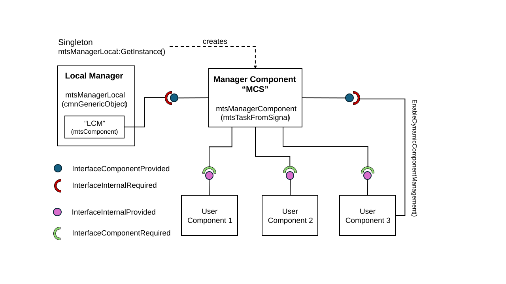

Design
======

Purpose
-------

This page provides design details for cisstMultiTask. It is intended for programmers maintaining the library. Library users should instead refer to the concepts and tutorial pages.

Component Management
--------------------

There are two primary system objects used for component management, as shown in the figure above:  (1) the local component manager, ``mtsManagerLocal``, and (2) the manager component, ``mtsManagerComponent``. The local component manager adopts the Singleton design pattern, so there is only one instance in the process. This instance is obtained (and created, if needed), by calling ``mtsManagerLocal::GetInstance()``. The ``mtsManagerLocal`` constructor creates an instance of ``mtsManagerComponent``, which is named "MCS". Although ``mtsManagerComponent`` does not use the Singleton design pattern, it is effectively a Singleton because it can only be created by ``mtsManagerLocal``. Note that the name ``mtsManagerLocal`` is a historical artifact from an earlier implementation where cisstMultiTask natively supported multiple processes -- in that prior design, each process had a local manager and the overall system had a global manager. However, that design has been abandoned and currently cisstMultiTask only supports multiple components in a single process. Users can instantiate "bridges" (for example, ``cisst-to-ros`` bridges) to interface with other processes, which may or may not be based on cisstMultiTask.

The Manager Component ("MCS") is a task with its own thread. It is derived from ``mtsTaskFromSignal``, which means that it sleeps until it receives a command (via a provided interface) or an event (via a required interface). The key provided interface is called "InterfaceComponentProvided" -- it provides the following component management services:

.. list-table::
   :header-rows: 1
   :widths: auto

   * - Command Name
     - Command Type
     - Arg Type
     - Return Type
     - Purpose
   * - ComponentCreate
     - WriteReturn
     - mtsComponentDescription
     - bool
     - Dynamically create (and add) component
   * - ComponentAdd
     - WriteReturn
     - mtsComponentPointer
     - bool
     - Add a component to the manager
   * - ComponentRemove
     - WriteReturn
     - std::string
     - bool
     - Remove specified component
   * - ComponentGet
     - QualifiedRead
     - std::string
     - mtsComponentPointer
     - Get pointer to specified component
   * - ComponentConfigure
     - Write
     - mtsDescriptionComponent
     -
     - Call component ``Configure`` method
   * - ComponentConnect
     - WriteReturn
     - mtsDescriptionConnection
     - bool
     - Connect two components
   * - ComponentDisconnect
     - WriteReturn
     - mtsDescriptionConnection
     - bool
     - Disconnect two components
   * - ComponentStart
     - Write
     - mtsComponentStatusControl
     -
     - Call component ``Start`` method
   * - ComponentStop
     - Write
     - mtsComponentStatusControl
     -
     - Call component ``Suspend`` method
   * - ComponentResume
     - Write
     - mtsComponentStatusControl
     -
     - Call component ``Start`` method
   * - ComponentGetState
     - QualifiedRead
     - mtsDescriptionComponent
     - mtsComponentState
     - Get component state
   * - LoadLibrary
     - QualifiedRead
     - mtsDescriptionLoadLibrary
     - bool
     - Dynamically load specified library
   * - GetNamesOfProcesses
     - Read
     -
     - std::vector<std::string>
     - Get names of processes (OBSOLETE)
   * - GetNamesOfComponents
     - QualifiedRead
     - std::string
     - std::vector<std::string>
     - Get names of components in process
   * - GetDescriptionsOfComponents
     - QualifiedRead
     - std::string
     - std::vector<mtsDescriptionComponent>
     - Get details of components
   * - GetNamesOfInterfaces
     - QualifiedRead
     - mtsDescriptionComponent
     - mtsDescriptionInterface
     - Get list of component interfaces
   * - GetDescriptionsOfInterfaces
     - QualifiedRead
     - mtsDescriptionComponent
     - mtsDescriptionInterfaceFull
     - Get details of component interfaces
   * - GetListOfConnections
     - Read
     -
     - std::vector<mtsDescriptionConnection>
     - Get list of connections
   * - GetListOfComponentClasses
     - QualifiedRead
     - std::string
     - std::vector<mtsDescriptionComponentClass>
     - Get list of available classes
   * - GetInterfaceProvidedDescription
     - QualifiedRead
     - mtsDescriptionInterface
     - mtsInterfaceProvidedDescription
     - Get details of provided interface
   * - GetInterfaceRequiredDescription
     - QualifiedRead
     - mtsDescriptionInterface
     - mtsInterfaceRequiredDescription
     - Get details of required interface

In addition, the provided interface generates four events (of type Write), called "AddComponentEvent", "AddConnectionEvent", "RemoveConnectionEvent", and "ChangeState". TODO: add an event "RemoveComponentEvent".

Note, however, that users should never need to directly invoke these commands. Instead, there is a wrapper class ``mtsManagerComponentServices`` that provides a more convenient interface. In particular, many of the above commands refer to a process name (again, due to the historical support for multiple processes). Currently, it is sufficient to leave the process name empty (i.e., empty string) and this is handled by the methods in ``mtsManagerComponentServices``.

Since "MCS" makes the component management services available through a provided interface ("InterfaceComponentProvided"), these services can only be accessed by another component with a required interface. There are two ways to access these services:

1. From anywhere, via ``mtsManagerLocal::GetInstance()->GetManagerComponentServices()``. This is implemented by having ``mtsManagerLocal`` create an internal component, called "LCM", with the matching required interface ("InterfaceInternalRequired"), that is then connected to the "MCS" provided interface. Currently, this method is not thread-safe. See also the section below on ``mtsManagerLocal``

2. From within a component, via ``this->GetManagerComponentServices()``. There are two sub-cases:

   a. If the component called ``EnableDynamicComponentManagement()`` in its constructor, the system creates the matching required interface ("InterfaceInternalRequired") in the component and connects it to the "MCS" provided interface. This allows thread-safe access to the manager component services, at least for components that have their own threads (tasks, i.e., derived from ``mtsTask``). Note, however, that ``GetManagerComponentServices()`` will fall back to the behavior described in the sub-case below if the component is not yet connected to "MCS" or if it is called from a thread other than the one belonging to the task.

   b. For components that did not call ``EnableDynamicComponentManager()`` in their constructor, ``GetManagerComponentServices()`` returns ``mtsManagerLocal::GetInstance()->GetManagerComponentServices()`` (i.e., the first case above).

The figure above also shows several user components, where each user component has a provided interface called "InterfaceInternalProvided" (the "LCM" component also has this provided interface, but it has been omitted for simplicity). When the component is added to the Manager Component, the Manager Component dynamically creates a required interface "InterfaceComponentRequiredForXXXX" where "XXXX" is the name of the component being added. Currently, the component interface provides two commands that are used when connecting components:  ``GetEndUserInterface`` and ``AddObserverList``, and two commands that are used when disconnecting components:  ``RemoveEndUserInterface`` and ``RemoveObserverList``. All four of these commands pertain to the provided (or output) interface in the connection.

Local Manager Singleton
-----------------------

As explained above, a cisstMultiTask process has one instance of ``mtsManagerLocal``, which is created/obtained by calling the static method ``GetInstance``. The Local Manager provides several services:

1. Access to the Manager Component services described above, through methods that internally call ``GetManagerComponentServices`` (note that ``GetManagerComponentServices`` is also a public method).

2. Extended component management services, including:

   a. Methods that operate on all components, such as ``CreateAll``, ``StartAll``, ``KillAll`` and ``WaitForStateAll``.

   b. Methods that enable component management through JSON strings.

   c. Methods to manage component and interface tags.

3. Access to a global (for the process) time server.

4. Methods for log management (somewhat obsolete).

5. Methods to obtain a list of IP addresses on the machine (historical artifact)

There is also a ``DeleteInstance`` method to destroy the Singleton object.
