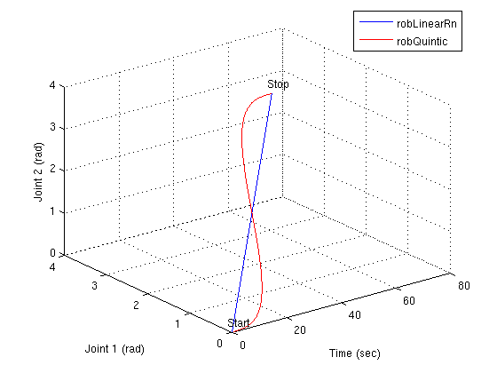
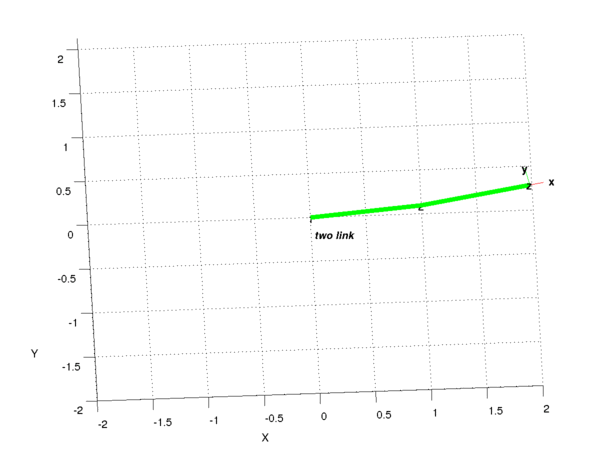

About
=====

A set of functions for interpolating and blending trajectories. **robFunction** is the base class for all robot functions. Since this is a robotics library, we are only interested in **Rn**, **SO3** and **SE3** spaces. In fact, SE3 is treated as a combination of R3 and SO3 space here. For each type of spaces, a base class derived from robFuntion is defined, which can be further inherited by function classes that implemented different interpolation and blending algorithms (e.g. robQuintic for robFunctionRn).

In this tutorial, robLinear is first used as an example showing basic use of robFunction. Then, we generate another interpolation using robQuintic, also the result is visually compared using Matlab. Finally, we demonstrate how to use robFunction in robot trajectory generation in joint space.

robFunction
===========

The question here given two positions (start, stop), how do you interpolate points between them. For simplicity, let's consider R2 space. If we put in real number, start position is q0 = [0, 0] and stop position is q1 = [pi, pi]. One simple approach is to use linear interpolation. So first joint position time series would be like 0, 0.1, 0.2, 0.3, ...., 0.9, 1.0. robLinearRn does exactly that for you and the interface is simple. In the constructor, all you need to do is to pass start position, stop position, max velocity constraint and start time. And then later, you can pass current time and get interpolated position, velocity and acceleration. See `mainLinearRn.cpp </jhu-cisst/cisst/tree/main/cisstRobot/examples/mainLinearRn.cpp>`__

.. code:: cpp

       // define function
       robLinearRn Linear(q0,      // start pos
                          q1,      // stop pos
                          vmax,    // vmax
                          tstart); // start time

       // evaluate q based on time 
       Linear.Evaluate(t, q, qd, qdd);

Compare robLinear and robQuintic
--------------------------------

So you know how to use robLinear now, then what is the difference between different robFunctionRn? Good question, short answer is they apply different algorithm for interpolation. Let's use robLinearRn and robQuintic as an example. See `mainQuinticRn.cpp </jhu-cisst/cisst/tree/main/cisstRobot/examples/mainQuinticRn.cpp>`__

In this example, we use robLinearRn and robQuintic to interpolate between q0 and q1. And later in the while loop log the output of these two to two seperate log files.

.. code:: cpp

       // define robLinearRn function
       robLinearRn Linear(q0,      // start pos
                          q1,      // stop pos
                          vmax,    // vmax
                          tstart); // start time
       // update tstop
       tstop = Linear.StopTime();

       // define robQuintic function
       robQuintic Quintic(tstart,
                          q0, qd0, qdd0,
                          tstop,
                          q1, qd1, qdd1);

Once, we get the data, then a Matlab script `QuinticRn.m </jhu-cisst/cisst/tree/main/cisstRobot/examples/QuinticRn.m>`__ takes the two log file and plot them.

As we can see in this figure, robLinearRn really just linearly interpolate each joint. There is no guarantee of continuity of velocity and acceleration. However, robQuintic uses a fifth order polynomial to interpolate and thus velocity can be continuous.

Use robFuntion result as robot trajectory
-----------------------------------------

If this visual comparison is not enough for you, let's make use of Peter Corke's Matlab Robotics Toolbox to visually see the trajectory.

.. code:: matlab

   % run QuinticRn.m 
   QuinticRn;

   % load twolink robot 
   mdl_twolink; 

   % use Linear
   twolink.plot(qLinear, 'fps', 60);

   % use Quintic
   twolink.plot(qQuintic, 'fps', 60);

Class Hierarchy
---------------

-  robFunction

   -  robFunctionRn

      -  robLinearRn
      -  robQLQRn
      -  robQuintic

   -  robFunctionSE3

      -  robLinearSE3

   -  robFunctionSO3

      -  robCubicSO3
      -  robSLERP
