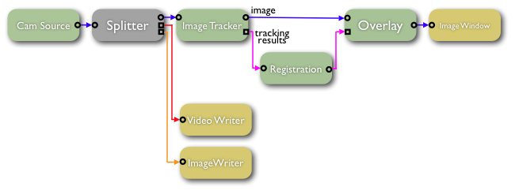
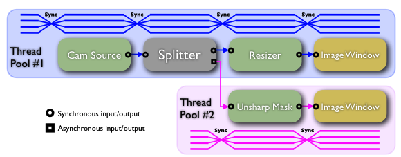
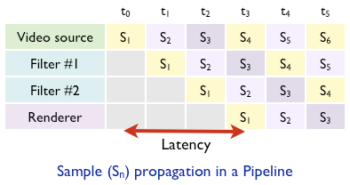
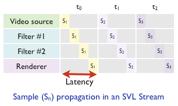

Tutorial
========

-  :doc:`Part 1 </libraries/cisstStereoVision/tutorials/tutorial-1>` - Intro to CISST, Subversion, CMake; Creating CISST projects; Intro to Filters and Streams
-  :doc:`Part 2 </libraries/cisstStereoVision/tutorials/tutorial-2>` - Filters, streams, samples, input/outputs, connections, a couple simple examples
-  :doc:`Part 3 </libraries/cisstStereoVision/tutorials/tutorial-3>` - Threading recap, available filters, image window event handling, examples
-  :doc:`Part 4 </libraries/cisstStereoVision/tutorials/tutorial-4>` - Image window event handling, creating custom filters, examples
-  :doc:`Part 5 </libraries/cisstStereoVision/tutorials/tutorial-5>` - Creating custom filters, multithreading, splitter filter, examples
-  :doc:`Part 6 </libraries/cisstStereoVision/tutorials/tutorial-6>` - Image overlays, examples

Introduction
============

-  cisstStereoVision (SVL) is part of the *cisst* libraries
-  Object-Oriented (C++) API and component based
-  Optimized for real-time stream (image and other) processing and visualization
-  Cross-platform (Windows, Linux, Mac OS X), open source (see *cisst* license)
-  Single interface for accessing a wide variety of video capture and display devices
-  Supports most important image and video file formats
-  Multi-threaded, but keeps coding simple for users
-  Features cross-network live video streaming
-  Several processing functions already implemented
-  Easy to add custom processing
-  Compatible with OpenCV
-  In development: iOS platform support, GPU processing

Processing Architecture
=======================

-  Processing elements are called **filters**
-  Build algorithms by creating a directed graph of **filters**

.. _svl-streams-vs-pipelines-how-to-achieve-low-latency:

SVL **streams** vs. **pipelines**: How to achieve low latency?
--------------------------------------------------------------

Processing in SVL is performed in **streams** instead of **pipelines**.

-  **Pipeline**:
-  Each **filter** has its own thread(s)
-  A data sample can only be processed by one **filter** at a time
-  Different **filters** perform processing simultaneously on different data samples
-  Simultaneously running **filters** have to share CPU resources
-  SVL **Streams**:
-  A linear chain of connected **filters** is called a **stream**, which is managed by the **stream manager**
-  **Filters** don't have their own threads, instead a **stream manager** owns multiple threads
-  The **stream manager** concentrates all CPU resources on a single **filter** at a time
-  Once a **filter** finished processing, the **stream manager** starts processing the next **filter** in the graph
-  Comparison:
-  In a graph of parallelized X **filters**, both the **pipeline** and the SVL **stream** perform the same amount of computation in a given amount of time.
-  However the **pipeline** needs X times more time to process a single sample than the SVL **stream**, because it processes X samples simultaneously.

|image1| |image2|

Pros and Cons of SVL **stream**
-------------------------------

-  Pros:
-  Lowest possible latency
-  Better L3 cache hit performance because all cores work on the same sample
-  Cons:
-  Individual **filters** need multi-threaded implementation
-  Threads need to be synchronized after each **filter**

Data Samples
------------

-  Sample is the unit of data that is passed along in the stream
-  Implemented as C++ classes derived from ``svlSample`` base class
-  Samples may carry a variety of payload types (``svlSampleImage``, ``svlSampleMatrix``, ``svlSampleText``, etc.)
-  Each and every sample is time stamped
-  They have built in serialization & deserialization for easy I/O

Filter Inputs and Outputs
-------------------------

-  Filters have input and output **ports**
-  Filter graph topology is defined by how the filter inputs and outputs are connected
-  A special class of filters are called **source filters**, these do not need to have inputs but only outputs
-  Each input and output need to support one or more sample types
-  An output can be connected to an input only if there is a match between their supported sample types
-  Filters are allowed to have any number of inputs and outputs
-  A special filter, called :doc:`svlFilterSplitter </libraries/cisstStereoVision/filter-splitter>`, can be used to split any stream to multiple streams
-  There are two mayor type of ports:
-  Synchronous:
-  Can be only one sync input and one sync output on a filter
-  Samples from sync inputs are passed as arguments to the filter's ``Process`` method
-  ``Process`` method should return the output sample
-  Asynchronous
-  Can push and pull samples on the user's convenience in the ``Process`` method

Multi-threading
---------------

-  Each stream has one or more **thread pools**

-  A thread pool is a set of threads created and managed by a single controller module

-  The controller is able to assign tasks to individual threads

-  When a thread finishes the execution of the assigned task, the thread pool controller takes control again

-  In *cisstStereoVision*, the thread pool controllers in streams are called ``svlStreamManager``

-  Threads of the ``svlStreamManager`` are synchronized to perform simultaneous processing on filters

-  At any time, each thread is assigned the same task to execute

-  In the source code, tasks are implemented inside a ``Process()`` method in every filter

-  Consequently, at any given time, each thread in the thread pool is executing the ``Process()`` method of the same filter

-  When all threads finished executing the ``Process()`` method, the ``svlStreamManager`` instructs the threads to start executing the next filter's ``Process()`` method

-  Threads get synchronized between every two filters, so that no thread may run ahead or fall behind the others

-  A stream may have more than one thread pool in it, all of which are controlled by the same ``svlStreamManager``

-  These additional thread pools are created for each **async-output** to **sync-input** connections in the stream

-  Threads in different thread pools are not synchronized to each other, therefore stream branches run on their own thread pools independently from other branches

Connection Types
----------------

+--------+-------+----------------------------------------------------------------------------------------------------+-----------------------------------------------------------------+------------------------------------------------------------------------------------------------------------------------------+
| Output | Input | Thread Control                                                                                     | Sample Transfer                                                 | Efficiency                                                                                                                   |
+========+=======+====================================================================================================+=================================================================+==============================================================================================================================+
| Sync   | Sync  | Same thread pool                                                                                   | Sample object pointer                                           | Instantaneous                                                                                                                |
+--------+-------+----------------------------------------------------------------------------------------------------+-----------------------------------------------------------------+------------------------------------------------------------------------------------------------------------------------------+
| Async  | Sync  | **Async-output** creates new thread pool for the stream branch                                     | Sample deposited into the sample buffer of the **Async-output** | Sample is copied into the buffer; Sample processing will start right after the branch finishes processing the current sample |
+--------+-------+----------------------------------------------------------------------------------------------------+-----------------------------------------------------------------+------------------------------------------------------------------------------------------------------------------------------+
| Sync   | Async | Receiving filter already has to have it's own thread pool that is associated to its **Sync-input** | Sample deposited into the sample buffer of the **Async-input**  | Sample is copied into the buffer; Sample will get processed next time the receiver filter's ``Process()`` method is called   |
+--------+-------+----------------------------------------------------------------------------------------------------+-----------------------------------------------------------------+------------------------------------------------------------------------------------------------------------------------------+
| Async  | Async | Both filters already have their thread pools associated to their **Sync** connections              | Sample deposited into the sample buffer of the **Async-input**  | Sample is copied into the buffer; Sample will get processed next time the receiver filter's ``Process()`` method is called   |
+--------+-------+----------------------------------------------------------------------------------------------------+-----------------------------------------------------------------+------------------------------------------------------------------------------------------------------------------------------+

Filters
=======

-  Filters are C++ classes derived from ``svlFilterBase`` class
-  The '''Filter''' is the unit of processing element in the stream
-  Filters have inputs and outputs
-  Filters have states:

+-----------------+-----------------------------------------------------------------------------------------+-----------------------------------+------------------------------+
| State           | Description                                                                             | Transition IN                     | Transition OUT               |
+=================+=========================================================================================+===================================+==============================+
| ``Created``     | Filter object is instantiated                                                           | Standard C++ object instantiation | Standard C++ object deletion |
+-----------------+-----------------------------------------------------------------------------------------+-----------------------------------+------------------------------+
| ``Configured``  | Filter is configured for operation                                                      | Using the filter's custom API     | N/A                          |
+-----------------+-----------------------------------------------------------------------------------------+-----------------------------------+------------------------------+
| ``Connected``   | Filter is connected on it's input(s) and output(s); ready for ``Initialization``        | ``svlFilterOutput::Connect()``    | *Coming soon*                |
+-----------------+-----------------------------------------------------------------------------------------+-----------------------------------+------------------------------+
| ``Initialized`` | Filter input/output data samples are initialized; ready to ``Run``                      | ``StreamManager::Initialize()``   | ``StreamManager::Release()`` |
+-----------------+-----------------------------------------------------------------------------------------+-----------------------------------+------------------------------+
| ``Running``     | The filter's ``Process()`` method is called for every data sample by the stream manager | ``StreamManager::Play()``         | ``StreamManager::Stop()``    |
+-----------------+-----------------------------------------------------------------------------------------+-----------------------------------+------------------------------+

Available Filters (as of 04-18-2011)
------------------------------------

+-------------------------------------------------------------------------------------------+---------------------------------------------------------------------------------------------------------------------------------------------+--------------------+
| Name                                                                                      | Description                                                                                                                                 | Notes              |
+===========================================================================================+=============================================================================================================================================+====================+
| svlFilterSourceBuffer                                                                     | Source filter proxy; Used to create custom source filters in an application                                                                 |                    |
+-------------------------------------------------------------------------------------------+---------------------------------------------------------------------------------------------------------------------------------------------+--------------------+
| svlFilterSourceDummy                                                                      | Generates random image noise or puts a still image in the background; Used primarily for testing purposes                                   |                    |
+-------------------------------------------------------------------------------------------+---------------------------------------------------------------------------------------------------------------------------------------------+--------------------+
| svlFilterSourceImageFile                                                                  | Reads sequences of image files                                                                                                              |                    |
+-------------------------------------------------------------------------------------------+---------------------------------------------------------------------------------------------------------------------------------------------+--------------------+
| svlFilterSourceTextFile                                                                   | Reads *tab* or *whitespace* separated numerical vectors from text files; Supports time synchronization of multiple text file sources        |                    |
+-------------------------------------------------------------------------------------------+---------------------------------------------------------------------------------------------------------------------------------------------+--------------------+
| svlFilterSourceVideoCapture                                                               | Captures video from cameras and frame grabbers                                                                                              |                    |
+-------------------------------------------------------------------------------------------+---------------------------------------------------------------------------------------------------------------------------------------------+--------------------+
| svlFilterSourceVideoFile                                                                  | Reads video files (or streaming video from the network)                                                                                     |                    |
+-------------------------------------------------------------------------------------------+---------------------------------------------------------------------------------------------------------------------------------------------+--------------------+
| svlFilterImageFileWriter                                                                  | Writes image file sequences                                                                                                                 |                    |
+-------------------------------------------------------------------------------------------+---------------------------------------------------------------------------------------------------------------------------------------------+--------------------+
| svlFilterVideoFileWriter                                                                  | Writes video files (or streams video across the network)                                                                                    |                    |
+-------------------------------------------------------------------------------------------+---------------------------------------------------------------------------------------------------------------------------------------------+--------------------+
| :doc:`svlFilterImageWindow </libraries/cisstStereoVision/filter-image-window>`   | Creates image windows to display incoming image samples                                                                                     |                    |
+-------------------------------------------------------------------------------------------+---------------------------------------------------------------------------------------------------------------------------------------------+--------------------+
| svlFilterImageWindowTargetSelect                                                          | Provides an image window where users can select points using the mouse                                                                      |                    |
+-------------------------------------------------------------------------------------------+---------------------------------------------------------------------------------------------------------------------------------------------+--------------------+
| :doc:`svlFilterSplitter </libraries/cisstStereoVision/filter-splitter>`         | Splits the stream into multiple branches                                                                                                    |                    |
+-------------------------------------------------------------------------------------------+---------------------------------------------------------------------------------------------------------------------------------------------+--------------------+
| svlFilterStreamTypeConverter                                                              | Converts between different sample types (if possible)                                                                                       |                    |
+-------------------------------------------------------------------------------------------+---------------------------------------------------------------------------------------------------------------------------------------------+--------------------+
| svlFilterComputationalStereo                                                              | Calculates disparity map from calibrated stereo image stream                                                                                |                    |
+-------------------------------------------------------------------------------------------+---------------------------------------------------------------------------------------------------------------------------------------------+--------------------+
| svlFilterDisparityMapToSurface                                                            | Calculates 3D surface mesh from calibrated disparity map                                                                                    |                    |
+-------------------------------------------------------------------------------------------+---------------------------------------------------------------------------------------------------------------------------------------------+--------------------+
| svlFilterImageBlobDetector                                                                | Detects connected components and labels them; generates list of blobs; filters blobs based on their properties                              |                    |
+-------------------------------------------------------------------------------------------+---------------------------------------------------------------------------------------------------------------------------------------------+--------------------+
| svlFilterImageBlobTracker                                                                 | Tracks connected components (blobs) on video                                                                                                | *work-in-progress* |
+-------------------------------------------------------------------------------------------+---------------------------------------------------------------------------------------------------------------------------------------------+--------------------+
| svlFilterImageCenterFinder                                                                | Computes the first order moment of the image and the dimensions of the used (non black) area                                                |                    |
+-------------------------------------------------------------------------------------------+---------------------------------------------------------------------------------------------------------------------------------------------+--------------------+
| svlFilterImageChannelSwapper                                                              | Converts the color space from *XYZ* to *ZYX*                                                                                                |                    |
+-------------------------------------------------------------------------------------------+---------------------------------------------------------------------------------------------------------------------------------------------+--------------------+
| svlFilterImageColorConverter                                                              | Converts between various color spaces (*RGB*, *HSV*, *HSL*, *YUV*)                                                                          |                    |
+-------------------------------------------------------------------------------------------+---------------------------------------------------------------------------------------------------------------------------------------------+--------------------+
| svlFilterImageColorSegmentation                                                           | Labels image pixels based on their similarity to user-provided colors                                                                       |                    |
+-------------------------------------------------------------------------------------------+---------------------------------------------------------------------------------------------------------------------------------------------+--------------------+
| svlFilterImageConvolution                                                                 | Performs 2D convolution on images with user-provided kernels                                                                                |                    |
+-------------------------------------------------------------------------------------------+---------------------------------------------------------------------------------------------------------------------------------------------+--------------------+
| svlFilterImageCropper                                                                     | Crops image area to the user-provided rectangle                                                                                             |                    |
+-------------------------------------------------------------------------------------------+---------------------------------------------------------------------------------------------------------------------------------------------+--------------------+
| svlFilterImageDeinterlacer                                                                | Attempts to remove interlacing artifacts from images                                                                                        |                    |
+-------------------------------------------------------------------------------------------+---------------------------------------------------------------------------------------------------------------------------------------------+--------------------+
| svlFilterImageDilation                                                                    | Performs morphological dilation                                                                                                             |                    |
+-------------------------------------------------------------------------------------------+---------------------------------------------------------------------------------------------------------------------------------------------+--------------------+
| svlFilterImageErosion                                                                     | Performs morphological erosion                                                                                                              |                    |
+-------------------------------------------------------------------------------------------+---------------------------------------------------------------------------------------------------------------------------------------------+--------------------+
| svlFilterImageExposureCorrection                                                          | Gamma, Brightness, and Contrast adjustments                                                                                                 |                    |
+-------------------------------------------------------------------------------------------+---------------------------------------------------------------------------------------------------------------------------------------------+--------------------+
| svlFilterImageFlipRotate                                                                  | Flips or rotates images                                                                                                                     |                    |
+-------------------------------------------------------------------------------------------+---------------------------------------------------------------------------------------------------------------------------------------------+--------------------+
| :doc:`svlFilterImageOverlay </libraries/cisstStereoVision/filter-image-overlay>` | Draws user-specified overlays on top of the image                                                                                           |                    |
+-------------------------------------------------------------------------------------------+---------------------------------------------------------------------------------------------------------------------------------------------+--------------------+
| svlFilterImageRectifier                                                                   | Rectifies calibrated image data                                                                                                             |                    |
+-------------------------------------------------------------------------------------------+---------------------------------------------------------------------------------------------------------------------------------------------+--------------------+
| svlFilterImageResizer                                                                     | Performs image resizing                                                                                                                     |                    |
+-------------------------------------------------------------------------------------------+---------------------------------------------------------------------------------------------------------------------------------------------+--------------------+
| svlFilterImageSampler                                                                     | The application may use this filter to get access to intermediate image data directly from the stream                                       |                    |
+-------------------------------------------------------------------------------------------+---------------------------------------------------------------------------------------------------------------------------------------------+--------------------+
| svlFilterImageThresholding                                                                | Performs gray level thresholding on the image                                                                                               |                    |
+-------------------------------------------------------------------------------------------+---------------------------------------------------------------------------------------------------------------------------------------------+--------------------+
| svlFilterImageTracker                                                                     | Tracks image patches on video; A few algorithms provided; Custom algorithms may be added by the user; Can enforce 2D rigid body constraints |                    |
+-------------------------------------------------------------------------------------------+---------------------------------------------------------------------------------------------------------------------------------------------+--------------------+
| svlFilterImageTranslation                                                                 | Applies translation to the image plane                                                                                                      |                    |
+-------------------------------------------------------------------------------------------+---------------------------------------------------------------------------------------------------------------------------------------------+--------------------+
| svlFilterImageUnsharpMask                                                                 | Performs ''Unsharp-Masking'' (high-pass filtering)                                                                                          |                    |
+-------------------------------------------------------------------------------------------+---------------------------------------------------------------------------------------------------------------------------------------------+--------------------+
| svlFilterImageZoom                                                                        | Magnifies images with respect to a user-provided image center location                                                                      |                    |
+-------------------------------------------------------------------------------------------+---------------------------------------------------------------------------------------------------------------------------------------------+--------------------+
| svlFilterLightSourceBuddy                                                                 | Device specific filter; Performs color balance correction for programmable light source                                                     |                    |
+-------------------------------------------------------------------------------------------+---------------------------------------------------------------------------------------------------------------------------------------------+--------------------+
| svlFilterStereoImageJoiner                                                                | Converts a stereo image stream into a mono stream by placing the two images side-by-side (other layouts also supported)                     |                    |
+-------------------------------------------------------------------------------------------+---------------------------------------------------------------------------------------------------------------------------------------------+--------------------+
| svlFilterStereoImageSplitter                                                              | Opposite of ''svlFilterStereoImageJoiner''; Separates previously joined stereo stream to real stereo stream                                 |                    |
+-------------------------------------------------------------------------------------------+---------------------------------------------------------------------------------------------------------------------------------------------+--------------------+
| svlFilterStereoImageOptimizer                                                             | Takes a stereo image input and corrects ''right'' channel brightness and color balance to match ''left'' channel                            |                    |
+-------------------------------------------------------------------------------------------+---------------------------------------------------------------------------------------------------------------------------------------------+--------------------+
| svlFilterToolTracker                                                                      | Detects and tracks the tool-tip and shaft of surgical instrument in the image stream                                                        |                    |
+-------------------------------------------------------------------------------------------+---------------------------------------------------------------------------------------------------------------------------------------------+--------------------+
| svlFilterVideoExposureManager                                                             | Used to control the exposure settings of video capture sources [IEEE1394 (Firewire) cameras]                                                |                    |
+-------------------------------------------------------------------------------------------+---------------------------------------------------------------------------------------------------------------------------------------------+--------------------+

Displaying Images and Handling User Inputs
==========================================

The cisstStereoVision library has a built in filter called :doc:`svlFilterImageWindow </libraries/cisstStereoVision/filter-image-window>` to display image data at any given stage of the stream. The image window filter provides a transparent, platform independent abstraction of window management. In order to handle keyboard and mouse inputs inside the image window, the user may register a event handler object to the filter that will receive callbacks upon user events. For more information on the image window filter and user input handling, see the page :doc:`svlFilterImageWindow </libraries/cisstStereoVision/filter-image-window>`.

Implementing Filters
====================

-  Every filter of the cisstStereoVision library is derived from the base class :doc:`svlFilterBase </libraries/cisstStereoVision/filter-base>`.
-  See examples :doc:`3 </libraries/cisstStereoVision/tutorials/tutorial-3>` and :doc:`4 </libraries/cisstStereoVision/tutorials/tutorial-4>` for sample code.
-  For information on thread synchronization in filters, see :doc:`Thread Synchronization Macros </libraries/cisstStereoVision/thread-sync>`

Stream Branches
===============

-  The *cisstStereoVision* library supports multiple parallel-running stream branches within one stream
-  Branches can be created by any filter by adding **asynchronous outputs**:
-  Branch is created automatically when the *async output* gets connected to a *sync input*
-  If output is connected to an async input, branch is not getting created since there is no direct processing triggered by either connector (see Filter Inputs and Outputs above)
-  The **branch root** is the asynchronous output from which the branch is originated
-  As the name of the asynchronous output implies, the branch will run in parallel with the parent branch without much synchronization:
-  It has its own thread pool
-  Synchronized to the parent branch only when it finishes processing a sample and requests a new sample from the branch root
-  Built in *stream splitter* filter is called :doc:`svlFilterSplitter </libraries/cisstStereoVision/filter-splitter>` that can be used to divide any stream into multiple asynchronous streams

