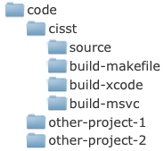
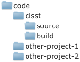

Introduction to the *cisst* libraries
=====================================

-  A collection of libraries to perform functions like

   -  Basic linear algebra calculations (``cisstVector``)
   -  Numerical methods, like SVD, Point-cloud registration, etc. (``cisstNumerical``)
   -  Real-time computer vision (``cisstStereoVision``)
   -  Handling various devices like trackers, haptic devices, etc. (SAW components, previously ``cisstDevices``)
   -  Robot control (``cisstRobot``)
   -  Communication through networks (``cisstMultiTask``, ``cisstOSAbstraction``, ``cisstStereoVision``)

-  Object-oriented C++ API

   -  Some parts of the library are heavily templated `C++ templates (Wikipedia) <http://en.wikipedia.org/wiki/Template_(programming)>`__

-  Open source, available through an online github repository
-  Platform independent (regularly tested on various Windows, Linux, and Mac OS X versions)
-  Uses CMake to create compiler/platform dependent projects from source

Windows specific pre-requisites
===============================

-  Microsoft `Visual Studio <http://www.microsoft.com/visualstudio/en-us/>`__

   -  Integrated Development Environment (`Wikipedia IDE <http://en.wikipedia.org/wiki/Integrated_development_environment>`__) for Microsoft Windows
   -  Contains C++ compiler and building tools
   -  Versions ``VS2008`` (9.0) and ``VS2010`` (10.0) are fully supported (``VS2005`` *(8.0) might also work*)
   -  Get a legal copy from your lab administrator

-  Tools and external dependencies

   -  Download the CMake binary package from `cmake.org <http://cmake.org/cmake/resources/software.html>`__ and install it
   -  ZLIB, JPEG and PNG dependencies (optional)

      -  Download the `ZLIB, JPEG and PNG support libraries (zip) <http://unittest.lcsr.jhu.edu/cisst/downloads/cisst/>`__
      -  Decompress the zip file into a folder called ``gnuwin32`` inside your code dependencies folder (if you have one)
      -  Add your ``[dependencies]\gnuwin32\bin`` folder into the ``$PATH`` (*Control Panel > System > Advanced > Environment variables*) as the **first entry**
      -  You will need to restart the computer for the ``$PATH`` changes to take effect

   -  OpenCV (optional)

      -  Download the `binary installer <http://opencv.org/downloads.html>`__ and install it to the default location
      -  In CMake, point to the folder containing the file ``OpenCVConfig.cmake``

Linux specific pre-requisites
=============================

-  The following instructions apply to `Ubuntu 9.04 or newer <http://www.ubuntu.com/>`__ distributions; it is recommended that you keep your OS version up-to-date

-  Tools and external dependencies

-  Make sure that the latest version of the following software packages (and all of their dependencies) are installed using `Synaptic Package Manager (Wikipedia) <http://en.wikipedia.org/wiki/Synaptic_(software)>`__ (*System > Administration > Synaptic Package Manager*)

-  If you don't have synaptic installed, ``sudo apt-get install synaptic``.

   =========== =============== ============ ===
   packages    .               .            .
   =========== =============== ============ ===
   subversion  libcv +dev      zlib +dev    gcc
   cmake       libhighgui +dev libjpeg +dev g++
   libx11 +dev libcvaux +dev   libpng +dev  
   libxv +dev  libdc1394 +dev               
   libqt4 +dev qt-creator                   
   =========== =============== ============ ===

-  Optional: `Qt Creator <http://qt.nokia.com/products/developer-tools/>`__ as your `IDE (Wikipedia) <http://en.wikipedia.org/wiki/Integrated_development_environment>`__

Mac OS X specific pre-requisites
================================

-  Apple `Xcode <http://developer.apple.com/technologies/tools/xcode.html>`__

   -  Integrated Development Environment (IDE) (`see on Wikipedia <http://en.wikipedia.org/wiki/Integrated_development_environment>`__) for Apple platforms
   -  Contains C++ compiler and building tools
   -  Xcode is available from the Apple AppStore

-  Tools and external dependencies

   -  In the followings we will assume that **Mac OS X** users have `MacPorts <http://www.macports.org/>`__ installed
   -  Once installed, enter the following commands in the terminal:

      .. code:: bash

         sudo port selfupdate
         sudo port upgrade outdated
         sudo port install opencv
         sudo port install subversion
         sudo port install libpng
         sudo port install jpeg
         sudo port cleanup all

-  **Please note**: This installation process may take several hours to complete. If you need to interrupt the process, you may do that any time by pressing ``CTRL+C``. In order to resume, just enter the last command that you previously terminated.
-  After all the above commands finish successfully, you will have all the external dependencies available on your computer that are required for the ``cisstStereoVision`` tutorial. However, you might need additional dependencies in the future to use with other *cisst* libraries.

Getting the source code
=======================

See :doc:`Git page for cisst </getting-started/download>`

Introduction to CMake
=====================

-  Tool to create platform-specific compiler projects for platform-independent source code

-  Supports virtually all major compilers and [ IDEs (Wikipedia)](http://en.wikipedia.org/wiki/Integrated_development_environment, such as *MS Visual C++*, *XCode* or *Makefile*)

-  **Windows**

   -  Download as binary installer from `cmake.org <http://cmake.org/cmake/resources/software.html>`__
   -  Run it from the *Start Menu*
   -  All GUI based, no terminal commands required

-  **Linux**, **Mac OS X**

   -  Get it using ``apt-get`` or *Synaptic* on Linux
   -  Get it using `MacPorts <http://www.macports.org>`__ on Mac OS X (see above): ``sudo port install cmake``
   -  Requires a simple terminal command to first create the project
   -  Already existing projects are managed in the textual GUI similar to the *Windows* version
   -  **Note**: Command name is ``ccmake`` (not ``cake``) for the text/curse based interface, ``cmake-gui`` for a GUI.

Separating the ``source`` and ``build`` trees
=============================================

-  In order to keep the *cisst* source code management simple, it is highly recommended that the build (compiler specific project) directories are created on the same level as the source code directory.

-  In the following example the directory ``cisst`` was created inside some main ``code`` directory, and inside ``cisst`` there is a single ``source`` directory for storing the source code and three different ``build-xxx`` directories for storing the compiler/platform specific projects for the single source code:

-  However, for most users who use only one development platform, a single ``build`` directory will suffice:

Creating compiler specific projects using CMake
===============================================

-  **Windows**

   -  Visual Studio

      1.  Open *CMake* from the *Start Menu*

      2.  Set the location of your ``source`` directory

      3.  Set the location of your ``build`` directory that you want to use for the Visual Studio project

      4.  Click *Configure*

      5.  Select your compiler from the list, and wait until your CISST settings show up

      6.  Check ``CISST_BUILD_cisstStereoVision``

      7.  Check ``CISST_BUILD_EXAMPLES``

      8.  Click *Configure*, and wait until done

      9.  Enable *Advanced* mode (just under the ``build`` directory field)

      10. Un-check all ``CISST_BUILD_*_EXAMPLES`` but keep ``CISST_BUILD_cisstStereoVision_EXAMPLES`` checked (we need only the stereo vision examples for this tutorial)

      11. Click *Configure*, and wait until done

      12. Scroll down in the list to find the options called ``CISST_SVL_HAS_*``

      13. ``CISST_SVL_HAS_DIRECTSHOW`` should appear to be already checked

      14. If you have *OpenCV* installed on your computer, check ``CISST_SVL_HAS_OPENCV2``. You might need to manually set ``OpenCV_DIR`` in CMake. This should point to the directory that contains the file *OpenCVConfig.cmake*.

      15. If you have the ''ZLIB+JPEG+PNG'' dependencies (see the paragraph ''Windows specific pre-requisites'') on your computer: a. Check ``CISST_SVL_HAS_JPEG``, ``CISST_SVL_HAS_PNG`` and ``CISST_SVL_HAS_ZLIB`` a. Click *Configure*, and wait until an error message shows up indicating that CMake failed to automatically find those dependencies a. Dismiss the error message dialog box a. Scroll down in the list and set the following options:

          ::

             JPEG_INCLUDE_DIR = [dependencies]\gnuwin32\include
             JPEG_LIBRARY     = [dependencies]\gnuwin32\lib\jpeg.lib

          a. Click *Configure*, and wait until done a. CMake should automatically be able to find all your *ZLIB+JPEG+PNG* dependencies; the newly found locations will show up on top of the list in red a. Click *Configure*, and wait until done

      16. You're all set: click *Generate* to create the Visual Studio "solution" (``.sln`` file), then close CMake.

-  **Linux**

   -  makefile (no IDE)

      1. Open a terminal
      2. Change to the ``build`` directory
      3. Enter the following command:

      .. code:: bash

         ccmake ../source

      1. Press ``c`` to *Configure*
      2. Set ``CISST_BUILD_cisstStereoVision`` to ``ON``
      3. Set ``CISST_BUILD_EXAMPLES`` to ``ON``
      4. Press ``c`` to *Configure*, and wait until done
      5. Press ``t`` to enable *Advanced* mode
      6. Set all ``CISST_BUILD_*_EXAMPLES`` to ``OFF`` but keep ``CISST_BUILD_cisstStereoVision_EXAMPLES`` ``ON`` (we need only the stereo vision examples for this tutorial)
      7. Make sure ``CISST_HAS_QT`` is set to ``OFF`` (this is not needed for this tutorial)
      8. Press ``c`` to *Configure*, and wait until done (CMake will automatically find all the dependencies for you)
      9. You're all set: press ``g`` to *Generate* the makefile project, then press ``q`` to quit CMake.

   -  Qt Creator

      1. Create a makefile project, as described above
      2. Open *Qt Creator* application (*Applications > Programming > Qt Creator*)
      3. In Qt Creator: select *File > Open File or Project...*
      4. Navigate to your ``source`` directory and select the ``CMakeLists.txt`` file to open
      5. In the pop-up *CMake Wizard* window set your ``build`` directory, then click *Next*
      6. On the next screen of the '*CMake Wizard* click *Run CMake*, and wait until done
      7. You're all set: click *Finish* to create the Qt Creator project

-  **Mac OS X**

   -  Xcode

      1.  Open a terminal

      2.  Change to the ``build`` directory

      3.  Enter the following command:

          .. code:: bash

             ccmake -G Xcode ../source

      4.  Press ``c`` to *Configure*

      5.  Set ``CISST_BUILD_cisstStereoVision`` to ``ON``

      6.  Set ``CISST_BUILD_EXAMPLES`` to ``ON``

      7.  Press ``c`` to *Configure*, and wait until done

      8.  Press ``t`` to enable *Advanced* mode

      9.  Set all ``CISST_BUILD_*_EXAMPLES`` to ``OFF`` but keep ``CISST_BUILD_cisstStereoVision_EXAMPLES`` ``ON`` (we need only the stereo vision examples for this tutorial)

      10. Press ``c`` to *Configure*, and wait until done (CMake will automatically find all the dependencies for you)

      11. You're all set: press ``g`` to *Generate* the Xcode project, then press ``q`` to quit CMake.

   -  makefile (no IDE) - same as for Xcode, except launch with the command line:

      .. code:: bash

         ccmake ../source

Building CISST
==============

-  **Windows**

   -  Visual Studio

      1. Open Visual Studio application in the *Start Menu*
      2. In Visual Studio: select *File > Open > Project\ ``/``\ Solution...*
      3. Select the file ``[build]\cisst.sln`` to open (or ``cisst-saw.sln`` if you decided to have cisst and SAW)
      4. Select *Build > Build Solution* from the menu bar to start compilation

-  **Linux**

   -  makefile

      1. Open a terminal
      2. Change to your ``build`` directory
      3. Compilation

         -  For single-thread compilation, enter the command: ``make``
         -  For multi-thread compilation, enter the command (where ``x`` is the number of threads: ``2``, ``4``, ``8``, etc.): ``make -jx``

   -  Qt Creator

      1. Make sure that the project was created by following the instructions in paragraph *Creating compiler specific projects using CMake*
      2. Open Qt Creator application (*Applications > Programming > Qt Creator*)
      3. In Qt Creator: select *File > Open File or Project...*
      4. Navigate to your ``source`` directory and select the ``CMakeLists.txt`` file to open
      5. Select *Build > Build All* from the menu bar to start compilation

-  **Mac OS X**

   -  Xcode

      1. Open Xcode application
      2. In Xcode: select *File > Open...*
      3. Select the file ``[build]\cisst.xcodeproj`` to open (or ``cisst-saw.xcodeproj``)
      4. Select *Build > Build* from the menu bar to start compilation

   -  makefile - same as Linux makefile
