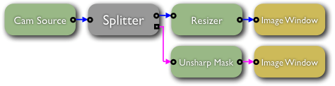

Introduction to cisstStereoVision Filters and Streams
=====================================================

-  Filters
-  Streams
-  Samples
-  Inputs and Outputs
-  Connections

Example 1 - A Simple Stream
===========================

Code under git repository: ``cisstStereoVision/examples/tutorial1/CMakeLists.txt``

.. literalinclude:: ../../../../cisstStereoVision/examples/tutorial1/CMakeLists.txt
   :language: cmake
   :start-after: # [doc-cmake-start]
   :end-before: # [doc-cmake-end]

Code under git repository: ``cisstStereoVision/examples/tutorial1/main.cpp``

.. literalinclude:: ../../../../cisstStereoVision/examples/tutorial1/main.cpp
   :language: c++
   :start-after: // [doc-simple-stream-start]
   :end-before: // [doc-simple-stream-end]

Stream Source
-------------

cisstStereoVision has a built in support for stereoscopic capture and processing. Video capture filters may take an ``unsigned int`` argument in the constructor that specifies the number of parallel video channels to be handled together in one stream.

**Please note**: The architecture supports any number of video channels within a stream, however in the current implementation capture filters support only 1 or 2 video channels.

.. code:: c++

       // stereo stream
       svlFilterSourceVideoCapture source_s(2);
       source_s.SetDevice(0, 0, SVL_LEFT);             // device=0, input=0, channel=LEFT
       source_s.SetDevice(1, 0, SVL_RIGHT);            // device=1, input=0, channel=RIGHT

       // mono stream
       svlFilterSourceVideoCapture source_m(1);
       source_m.SetDevice(2);                          // device=2, input=0, channel=LEFT

Assembling the Graph
--------------------

.. code:: c++

       // First the source filter needs to be assigned to the stream
       stream.SetSourceFilter(&source);

       // Then filters need to be connected by establishing connections between their input and output ports
       source.GetOutput()->Connect(filter1.GetInput());
       filter1.GetOutput()->Connect(filter2.GetInput());

Accessing Inputs and Outputs
----------------------------

The methods ``GetInput`` and ``GetOutput`` take one optional ``std::string &`` argument. If the argument is omitted then the methods return a pointer to the *synchronous* input or *synchronous* output port of the filter. If the argument is specified, then the methods look up the input or output that has the same name as the specified *string* argument. The specified name may correspond to either *synchronous* or *asynchronous* port.

.. code:: c++

       // Establishing 'synchronous' connection
       filter1.GetOutput()->Connect(filter2.GetInput());

       // Establishing 'asynchronous' connections
       filter1.GetOutput("output2")->Connect(filter2.GetInput());
       filter2.GetOutput()->Connect(filter3.GetInput("input2"));
       filter3.GetOutput("output2")->Connect(filter4.GetInput("input2"));

Example 2 - Stream with Splitter
================================

Code under git repository: ``cisstStereoVision/examples/tutorial1/main.cpp``

.. literalinclude:: ../../../../cisstStereoVision/examples/tutorial1/main.cpp
   :language: c++
   :start-after: // [doc-processing-stream-start]
   :end-before: // [doc-processing-stream-end]

.. _assembling-the-graph-1:

Assembling the Graph
--------------------

.. code:: c++

       // After instantiation of the splitter filter
       // it only has one default synchronous output
       svlFilterSplitter splitter;

       // By calling the AddOutput() method, you can
       // create any number of synchronous outputs on
       // the splitter. Each output on a single splitter
       // needs to have a unique name.
       splitter.AddOutput("out2");
       splitter.AddOutput("out3");

       filter1.GetOutput()->Connect(splitter.GetInput());

       // Connect the synchronous output of the splitter
       // by omitting the argument when calling GetOutput()
       splitter.GetOutput()->Connect(filter2.GetInput());

       // In order to connect aynchronous outputs, the
       // output names need to be specified
       splitter.GetOutput("out2")->Connect(filter3.GetInput());
       splitter.GetOutput("out3")->Connect(filter4.GetInput());
